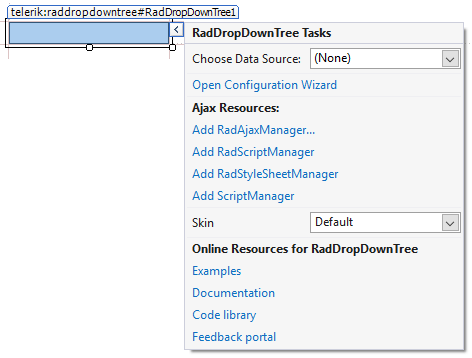

# Smart Tag

The **RadDropDownTree** Smart Tag allows easy access to frequently needed tasks. You can right-click on  a **RadDropDownTree** control in the design window to display the Smart Tag and then choose **Show Smart Tag**. You can also display the Smart Tag by clicking the small rightward-pointing button located at the upper right of the **RadDropDownTree** component.

>caption Figure 1: RadDropDownTree Smart Tag

## RadDropDownTree Tasks

* **Choose Data Source** lets you change the declarative binding by selecting a data source from a drop-down list of all available data source components. If you select "**\<New Data Source...\>**" the standard Windows [Data Source Configuration Wizard](https://msdn2.microsoft.com/en-us/library/ms247282(VS.80).aspx) appears, where you can create and configure a data source component. If you select "**(None)**", you remove the existing binding.

* **Open Configuration Wizard** opens the RadDropDownTree Configuration Wizard.

## Ajax Resources

* **Add RadAjaxManager...**: Includes a RadAjaxManager component on the form that allows for fine control over how controls are updated via AJAX.

* **Add ScriptManager**: Includes a ScriptManager, which manages ASP.NET Ajax script libraries and script files, partial-page rendering, and client proxy class generation for Web and application services.

* **Add RadScriptManager**: RadScriptManager performs the same tasks as **ScriptManager** but can also combine all for ASP.NET AJAX JavaScript resources into a single web resource request for better performance.

* **Add RadStyleSheetManager**: The RadStyleSheetManager component enables you to combine all CSS output for ASP.NET AJAX controls into a single stylesheet web resource request.

## Skin

**Skin** lets you select from a list of available [skins]() to customize the look of your **RadDropDownTree**.

## Online Resources

Links navigating directly to **RadDropDownTree** demos, documentation, code library and to the feedback portal of the controls suite.

# See Also

 * [Skins]()

 * [Configuration Wizard]()
