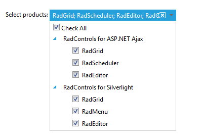
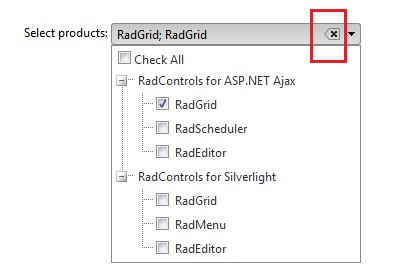

# Button Settings


You can take advantage of the additional functionality that we implemented with the RadDropDownTree control by usingthe ButtonSettings described below.

## Button Settings

>tip These settings are available after the **Q2 2013** release of the Telerik controls.
>


* **ShowCheckAll** - displays a checkbox that allows checking of all checkboxes in the dropdown;



* **ShowClear** - displays a button that clears the entries from the entry area.



Here is sample code demonstrating how to set them inline:

````ASPNET
<telerik:RadDropDownTree RenderMode="Lightweight" ID="RadDropDownTree1" runat="server" Width="250px" 
    DefaultMessage="Please select" CheckBoxes="SingleCheck"
    DataSourceID="ObjectDataSource1" DataFieldID="ID" DataFieldParentID="ParentID"
    DataTextField="Text">
    <ButtonSettings ShowCheckAll="true" ShowClear="true" />
</telerik:RadDropDownTree>
````


