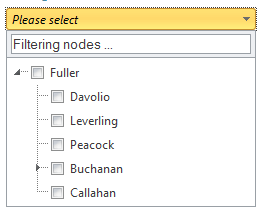
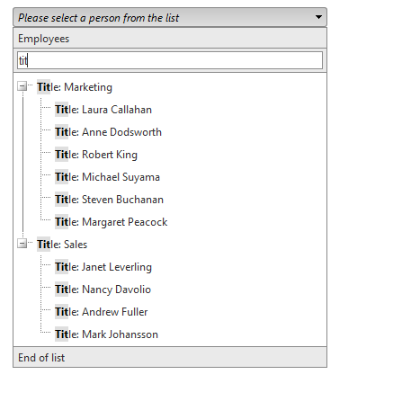
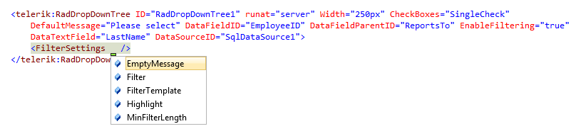
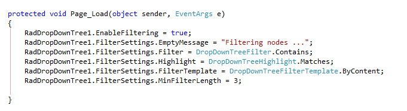

# Filtering

## Filtering

As of **Q2 2013**we introduced the filtering functionality in the RadDropDownTree. It is enabled through the **EnableFiltering** property of the RadDropDownTree control. By using the following **FilterSettings** the user can futher customize the functionality:

>note Note that the filtering functionality can not be used in a combination with WebService and it is not case sensitive.
>

**Filter**

The **Filter** property accepts two values:

* **Contains** - returns all nodes whose Texts' values contain the searched text as a substring;

* **StartsWith** - is the **default** value of the **Filter** property. It returns all nodes whose text start with the searched(typed) text.

**EmptyMessage**

By using the **EmptyMessage** property you can set a message in the filtering input to provid a hint to the user. Below is an example demonstrating the useof the property:

**FilterTemplate**

This property is used when a template is applied to the node.

* **ByContent** - when the **FilterTemplate** is set to the **ByContent**value, the filteringis implemented in the content itself (the text that is bound to the node and the content of the template, it there are additional controls)

* **ByText** - filters only by the text that is bound to the text of the node.

**Highlight**

* **Matches** - enables highlighting of the node when a match to the typed text is found;

* **None** - does not highlight text when a match of the typed text is found.

**MinFilterLength**

This property defines how many letters needto be typed in in the filter input before the nodes in the dropdown tree to get filtered.

**Setting the Filter Inline**

**Setting the Filter Server Side**
