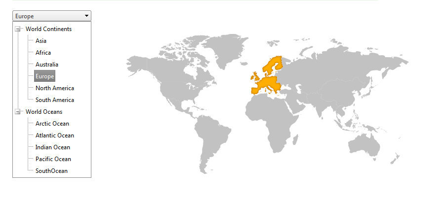

# DropDownTree Overview

## 

The **RadDropDownTree** control is a combination of a lightweight dropdown and a tree control.The approach with entries like in the RadAutoCompleteBox is used. Basically, an new entry is created as a resultof node's selection from the tree.

## Main features of the RadDropDownTree

Some of the main features of the RadDropDownTree control include:

* Various **DataBindings** including declarative binding, binding to **Entity DataSource** as well as **Linq DataSource**

* **Templates** such as **Header Template**, **Footer Template** and **Node Template**.

* **Checkboxes** that enable the user to choose between the different states - *None*, *SingleCheck*, *TriState* and *CheckChildNodes*.

* **EmptyMessage** that will allow the developer to provide a hint (setting a message in the entry area) to the final user of the application.

* There are also **DropDownSettings** that enable fine tuning of the control (*OpenDropDownOnLoad* that expands the dropdown after it is loaded on the page is one of them).

# See Also

 * [RadDropDownTree Overview](http://demos.telerik.com/aspnet-ajax/dropdowntree/examples/overview/defaultcs.aspx)
