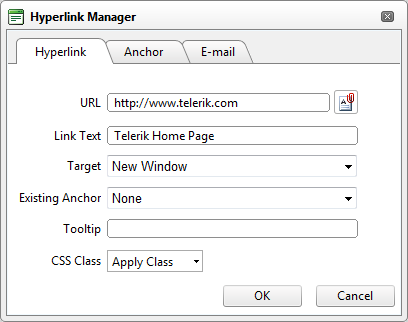

# Accessible Hyperlinks

A hyperlink can be interpreted by the narrative software if you specify an additional description in the "Tooltip" field.Note that link text should never be "click here" or "more information".The link text should always describe specifically where the user will navigate to once activating the link.

In the example below the Link Text should be "Telerik Home Page" there does not need to be a Tooltip added. Optionally the user could include the text "Link opens in New Window" see information at [https://www.w3.org/TR/2008/NOTE-WCAG20-TECHS-20081211/complete.html#H33](https://www.w3.org/TR/2008/NOTE-WCAG20-TECHS-20081211/complete.html#H33)

>caption Figure 2. Specified URL, Link Text and Target values in Hyperlink manager



The produced link markup is:

````HTML
<a href="https://www.telerik.com" target="_blank">Telerik Home Page</a>	          
````


