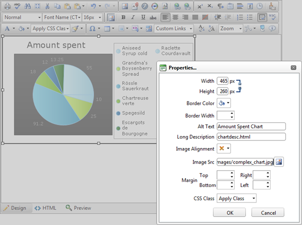

# Accessible Images


## 

An image can be interpreted by the narrative software if you specify an additional description in the "Long Description" field. To make an image accessible fill the **Alt Text** field. For example, insert a pie chart image and fill the box with "Amount Spent Chart". **Long Description** should be set when displaying charts and graphs to provide detailed information. The value of this box should point to a separate description file. For example, create an HTML file named **chartdesc.html** and write more detailed information about the image:*Amount Spent Chart Description. This chart shows the monthly amount spent on different products…*
>caption Figure 3. Specified Long Description field in Image Properties dialog



Here is the produced image tag:

````XML
	
	    
	          
````


Information on Alt Attribute[http://www.w3.org/TR/WCAG20-TECHS/H37.html](http://www.w3.org/TR/WCAG20-TECHS/H37.html) Information on LongDesc attribute[http://www.w3.org/TR/WCAG20-TECHS/H45.html](http://www.w3.org/TR/WCAG20-TECHS/H45.html)
