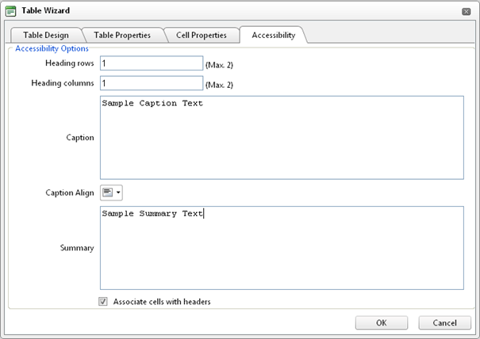

# Accessible Tables

The narrative software uses the information from the Accessibility table fields (heading rows, columns, caption alignment and summary) to produce a Tooltip message for each table cell. Users with impaired vision can see those Tooltips as they hover over the cells with the mouse. Also assistive technologies are able to read the text included in these fields and make it available through synthesized speech or Braille output.You can create a "Section 508"-compliant table with the Table Wizard. Alternatively, you can convert an existing table to a "Section 508"-compliant table using the Table Properties context menu.

>caption Figure 1. Accessibility tab of Table Wizard dialog



1. Create a new table with the Table Wizard or open the Table Properties dialog.

1. Click the "Accessibility" tab.

1. In the "Accessibility" tab, fill in the fields: Heading rows/columns, Caption, and Summary about the table. Select the [Associate cells with headers] checkbox.

	* The caption should specify the title of the table.For information about table captions [https://www.w3.org/TR/WCAG20-TECHS/H39.html](https://www.w3.org/TR/WCAG20-TECHS/H39.html)

	* Summary is used to give more details on the contents of the table.This attribute only needs to be completed if user sets 2 for the Heading rows or Heading columns field.For more information about Summary attribute include link to [https://www.w3.org/TR/WCAG20-TECHS/H73.html](https://www.w3.org/TR/WCAG20-TECHS/H73.html)

	* Always select the [Associate cells with headers] checkbox.

Here is an example demonstrating how the produced accessible table should look:

````HTML
<table summary="This table gives per diem rates for hotels and meals in Denver and Seattle for the Winter and Summer">    
	<caption>Per Diem Rates</caption>
	<tr>         
		<th></th>           
		<th colspan="2" id="hotels">Hotels</th>         
		<th colspan="2" id="meals">Meals</th>     
	</tr>     
	<tr>         
		<th id="city">City</th>         
		<th id="hwinter">Winter</th>          
		<th id="hsummer">Summer</th>           
		<th id="mwinter">Winter</th>          
		<th id="msummer">Summer</th>     
	</tr>     
	<tr>         
		<th id="loc" headers="city">Seattle</th>         
		<td headers="loc hotels hwinter"> $200</td>         
		<td headers="loc hotels hsummer">$150</td>           
		<td headers="loc meals mwinter">$70</td>         
		<td headers="loc meals msummer">$90</td>     
	</tr>     
	<tr>         
		<th id="loc2" headers="city">Denver</th>         
		<td headers="loc2 meals hwinter">$170</td>         
		<td headers="loc2 meals hsummer">$180</td>           
		<td headers="loc2 meals mwinter">$75</td>         
		<td headers="loc2 meals msummer">$75</td>     
	</tr> 
</table> 				
````


