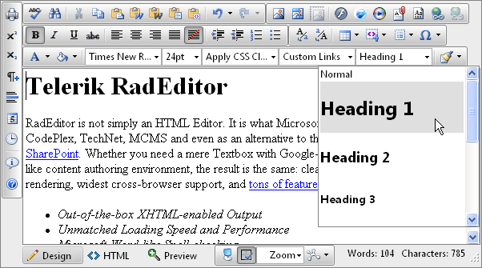

# Use Headers in Content

## 

If there is a large amount of text (over 750 characters) then headers make it much easier for all users to navigate through the content. You can see how to apply a heading in RadEditor in the Apply Paragraph Styles section in [RadEditor's End User Manual](http://www.telerik.com/documents/RadEditorAjaxEndUserManual.pdf), e.g.

Predefined paragraph styles are used to ease the process of formatting paragraphs. The user can apply consistent paragraph styles to a document. The predefined styles include different heading styles, and other styles defined by the developer. To apply a paragraph style to some text, first place the cursor within the text, then from the paragraph styles dropdown list, select the style you want to apply.
>caption Figure 4. Expanded Format Block dropdown popup

More information about heading is available at: [http://www.w3.org/TR/WCAG20-TECHS/H42](http://www.w3.org/TR/WCAG20-TECHS/H42).
