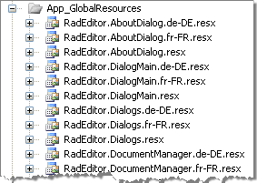

# Create a New Language

With RadEditor you can create a new language pack or alter some of the labels of an existing language pack. All of the text used in RadEditor is obtained from [resource files](), which look similar to the example below:


Each dialog, module or a context-menu has its own localization resource file located in the App_GlobalResources folder.



The best way to create a new language is to duplicate an existing set of resource files and modify them. For example to create a new Italian resource file for Tools, you can copy the default RadEditor.Tools.resx to RadEditor.Tools.it-IT.resx.

>note The culture name has to follow the RFC 1766 standard in the format [Language Code]-[County/Region Code]. In our example, it-IT stands for Italian - Italy.

Then open the resource file in Visual Studio and change the **Value** column entries to their Italian counterparts.


Set the [Language](https://www.telerik.com/help/aspnet-ajax/p_telerik_web_ui_radeditor_language.html) property to the new culture code that represents the language at design-time:

````ASP.NET
<telerik:RadEditor RenderMode="Lightweight" ID="RadEditor1" runat="server" Language="it-IT" ></telerik:RadEditor>
````

...or run-time:

````C#
RadEditor1.Language = "it-IT"; 
````
````VB
RadEditor1.Language = "it-IT"
````

When you run the application, the new resources will be recognized and the corresponding hints or other UI elements will display in the new language:


