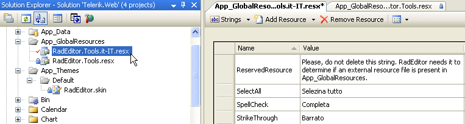

# Global Resource Files

With RadEditor you can create a new language pack or alter labels of an existing language pack.

Localization strings are contained in resource (.resx) files. The resource files can be found in the installation directory under "\App_GlobalResources". There are three built-in localizations (English, French and German) which can be set through the **Language** property. For example to localize the editor in German set Language="de-DE".

To create your own localizations for the editor, you need to create the **App_Global Resources** folder in the root of your web application and copy the English resx files into it.

* **RadEditor.Dialogs.resx**

* **RadEditor.Main.resx**

* **RadEditor.Modules.resx**

* **RadEditor.Tools.resx**

After you have copied the resx files, you must duplicate each copy of these files and rename them using the syntax shown in the few examples below:

* **RadEditor.Dialogs._&lt;Your_Language&gt;_.resx**

* **RadEditor.Main._&lt;Your_Language&gt;_.resx**

* **RadEditor.Modules._&lt;Your_Language&gt;_.resx**

* **RadEditor.Tools._&lt;Your_Language&gt;_.resx**

All resx file contain two columns: **Name** and **Value** as it is shown below:



>note It is mandatory to set the ReservedResource string in the Name column of the RadEditor.Tools._&lt;Language&gt;_.resx file. Without this string the resource files will not be recognized.

After renaming the files, localize the strings in the **Value** column of your new **resx** files. Then set the **Language** property of RadEditor to the name of the `<localization>` string in the **RadEditor.Tools._&lt;Language&gt;_.resx** file:

````ASP.NET
<telerik:radeditor runat="server" id="RadEditor1" language="it-IT"></telerik:radeditor>
````

````C#
RadEditor1.Language = "it-IT";
````
````VB
RadEditor1.Language = "it-IT"
````


>note **If you provide a new localization for RadEditor for ASP.NET AJAX which works properly, we will gladly reward you for your work.** 

