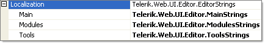

# Localization Property


## 

In addition to localizing through [global resource files](), RadEditor allows programmatic localization using the __Localization__property. All labels, buttons, tooltips and error messages can be localized by using the __Localization__ property. The Localization property has sub properties for Tools, Modules and Main.
>caption 



>tabbedCode

````C#
		protected void Page_Load(object sender, EventArgs e)
		{
			if (!IsPostBack)
			{
				RadEditor1.Localization.Tools.Copy = "My Copy text";
			}
		} 
````


````VB.NET
		Protected Sub Page_Load(ByVal sender As Object, ByVal e As EventArgs)
			If Not IsPostBack Then
				RadEditor1.Localization.Tools.Copy = "My Copy text"
			End If
		End Sub
````


>end

>note Localization strings defined through the __Localization__ property can take precedence over those defined in[global resource files]()(assuming the Page_Load event occurs after the resource file has already been consumed). This allows you to localize specific strings programmatically while the default localization is handled by the resource files.
>


# See Also

 * [Localization](http://demos.telerik.com/aspnet/prometheus/Editor/Examples/Localization/DefaultCS.aspx)
