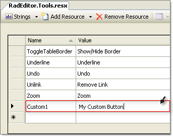
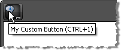

# Localize Buttons, ToolTips, etc


## 

RadEditor is fully localized from resource files placed in the App_GlobalResources folder. You can localize all standard and custom editor buttons from the localization resource files. For each new custom tool added in the ToolsFile.xml or programmatically through the code-behind, add a new entry to theRadEditor.Tools.resx file having the same ID as the tool name:
>caption 



The tools can be defined through the ToolsFile.xml, added declaratively or programmatically at run-time. The critical detail is that the tool name must match the **Name** column in the resource file.

````XML
	    <root>  
	        <tools name="MainToolbar" enabled="true" >    
	            <tool name="Custom1" shortcut="CTRL+1" />  
	        </tools>
	    </root>
````


````ASPNET
	    <telerik:RadEditor ID="RadEditor1" runat="server">
	        <Tools>
	            <telerik:EditorToolGroup>
	                <telerik:EditorTool Name="Custom1" ShortCut="CTRL+1" />
	            </telerik:EditorToolGroup>
	        </Tools>
	    </telerik:RadEditor>
````


````C#
	
	        RadEditor1.Tools.Clear();
	        EditorToolGroup main = new EditorToolGroup();
	        RadEditor1.Tools.Add(main);
	        EditorTool custom1 = new EditorTool();
	        custom1.Name = "Custom1";
	        custom1.ShortCut = "CTRL+1";
	        main.Tools.Add(custom1);
	
````
````VB
	
	        RadEditor1.Tools.Clear()
	        Dim main As New EditorToolGroup()
	        RadEditor1.Tools.Add(main)
	        Dim custom1 As New EditorTool()
	        custom1.Name = "Custom1"
	        custom1.ShortCut = "CTRL+1"
	        main.Tools.Add(custom1)
	
````


When you run the application, the new button will display with the string from the resource file **Value** column for that tool:
>caption 



>tip Defining the "Text" of the tool will override the text from the resource file.
>


# See Also

 * [Add Your Own Buttons]()
