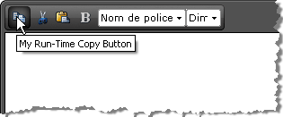

# Text Property

Another way to localize RadEditor labels, buttons and tooltips is by using the **Text** property:

````C#
protected void Page_Load(object sender, EventArgs e)
{
	if (!IsPostBack)
	{
		Telerik.Web.UI.EditorTool tool = RadEditor1.FindTool("Copy");
		if (tool != null)
		{
			tool.Text = "My Copy Button";
		}
	}
} 
````
````VB
Protected Sub Page_Load(ByVal sender As Object, ByVal e As EventArgs)
	If Not IsPostBack Then
		Dim tool As Telerik.Web.UI.EditorTool = RadEditor1.FindTool("Copy")
		If tool <> Nothing Then
			tool.Text = "My Copy Button"
		End If
	End If
End Sub
````


You can also set the **Text** property inline in the RadEditor declaration:

````ASP.NET
<telerik:RadEditor RenderMode="Lightweight" runat="server" ID="RadEditor1">
   <Tools>
	   <telerik:EditorToolGroup>
		   <telerik:EditorTool Name="Copy" Text="My copy button" />
		   <telerik:EditorTool Name="Bold" Text="My bold button" />
		   <telerik:EditorTool Name="Custom" Text="My custom button" />
	   </telerik:EditorToolGroup>
   </Tools>
</telerik:RadEditor> 
````


## Order of Precedence

The order of precedence for localization is generally that **Text** assigned at runtime (in the Page_Load for example) is considered first, then in-line declaration and lastly the resource file strings are the default.For example, if the **Language** property is set to "fr-FR", the editor tool in-line **Text** declaration for the "Copy" tool is "My In-Line Copy Button" and the Page_Load event handler includes an assignment "My Runtime Copy Button", the run-time assignment will win out:


