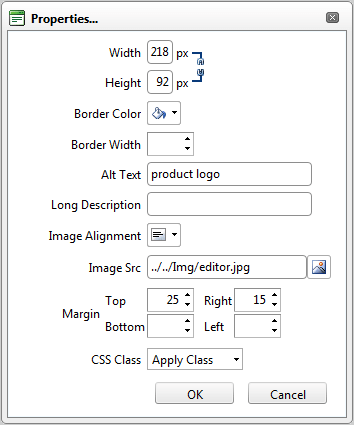
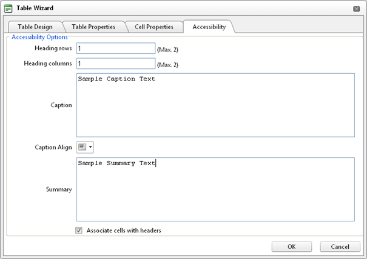

# WCAG 2.0 and Section 508 Accessibility Compliance

## Compliance Level

Telerik RadEditor satisfies the requirements for accessibility, which is a result of the following:1. The interface of the Telerik**RadEditor** is **"Level AAA"** accessible (in compliance with the	**W3C Web Accessibility Guidelines 1.0**). Listed below are the product's accessibility features:

* Telerik RadEditor passes the check of the W3C accessibility validator (click the W3C logo on one of the on-line examples)

* all tools and commands can be associated with shortcuts either in [ToolsFile]() or with a property of the object.

* all toolbars can be arranged in accordance with your preferences. You can [drag and dock]() the toolbars on the edges of the editable area, just like in Microsoft Office applications.

* you can create custom skins [custom skins]() with more accessible appearance (e.g. larger buttons, high-contrast colors, etc.)

* **Full keyboard accessibility** - RadEditor for ASP.NET AJAX is a fully keyboard navigable component, including shortcuts to open and operate with drop-downs, tools and dialogs, achieving true accessibility.

* F10- focus goes on toolbars

* toolbars navigation - use arrow keys or TAB / Ctrl-TAB key

* RadEditor also provides the ability to navigate dropdown items as well. Press enter to execute command.

* **Dialogs accessibility** - ability to switch dialog tabs with keyboard and to navigate dialog controls with Tab.

2. The content generated by the Telerik RadEditor can become accessible if the author fills in all required fields (marked with a special accessibility icon).

Every content element, which is more complex than pure text, has additional accessibility fields for detailed description (e.g. tooltip, long description, etc.)
>caption 

New or existing tables can be enriched with special accessibility fields from the **Table Wizard** or from the **Table Properties** dialog
>caption 

## Section 508

The USA federal mandate requires that information technology be made accessible to people with disabilities. Much of Section 508 compliance concerns making Web sites, intranets, and web-enabled applications accessible. Section 508 compliance has since become a major prerequisite not only in government related software, but also in most enterprise and corporate software solutions.

## W3C Web Content Accessibility Guidelines 1.0

The main goal of these guidelines is to encourage developers in creating applications providing accessible contents. However, adhering to these guidelines will also make Web content more accessible to all kind of users, using different devices and interfaces: desktop browser, voice browser, mobile phone, automobile-based personal computer, etc.

In accordance with these guidelines W3C defines three levels of conformance developers may implement in order to provide some level of content compliance to their products:

* **Compliance Level "A"**

* **Compliance Level "AA"**

* **Compliance Level "AAA"**

For more details on W3C "Web Content Accessibility Guidelines 1.0" see [http://www.w3.org/TR/WAI-WEBCONTENT/](http://www.w3.org/TR/WAI-WEBCONTENT/)

In our attempt to make our products content compliant, each web-control we develop and its QSF strive to obtain at least one of conformance levels listed above.

# See Also

 * [Accessibility Compliance](http://demos.telerik.com/aspnet/prometheus/Editor/Examples/AccessibilitySupport/DefaultCS.aspx)
