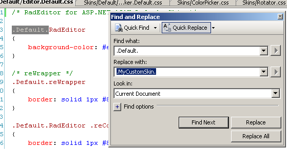
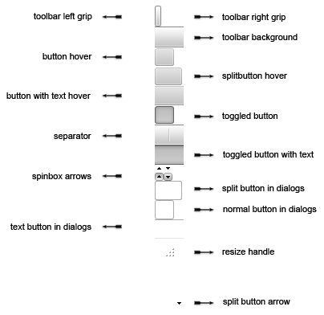
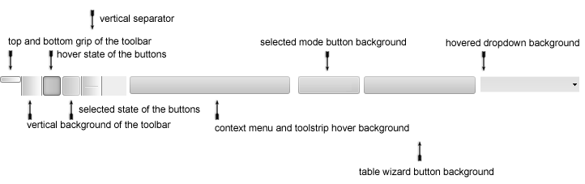
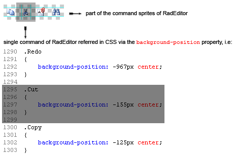
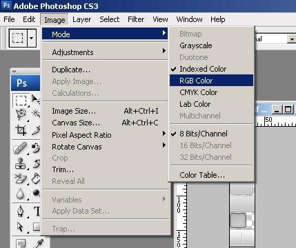
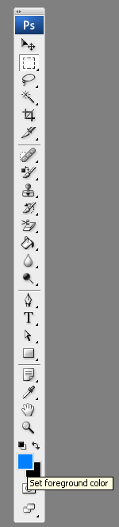
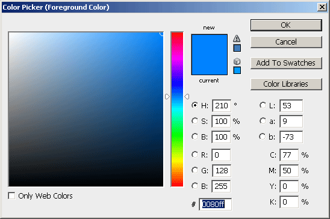
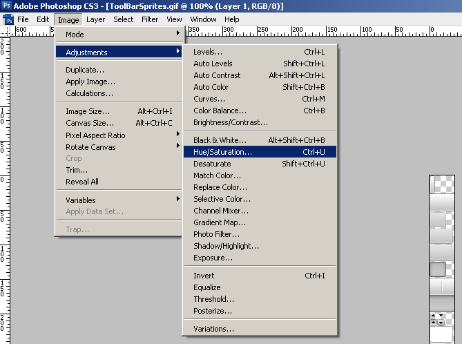
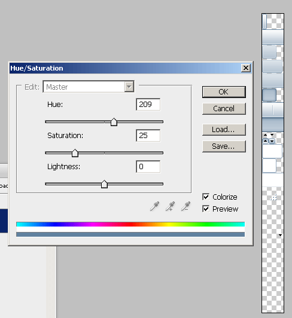

# Create a Custom Skin


## RadEditor for ASP.NET AJAX CSS: Classes and Their Use

Each of the controls included in the Telerik UI for ASP.NET AJAX suite is styled with two CSS files that are loaded in a certain order. The first one - ControlName.css, also called __base stylesheet__ contains CSS properties and values that are common for all skins, i.e it is layout-specific, not skin-specific. These are CSS float, padding, margin, font-size, font-family, etc. In the general case, when creating a custom skin for a control this file should not be edited, unless the custom skin needs different sizes, paddings or margins.

The second file represents the actual skin of the control, and its name consists of the control name plus the skin name, i.e - Editor.Default.css. Upon creating a custom skin for the control, one should edit that particular file, as it contains skin-specific CSS properties, and references to images, colors, borders and backgrounds.

## Creating a Custom Skin for RadEditor for ASP.NET AJAX from an Existing One

__Getting and Renaming Files and CSS Classes__

In order to explain better the CSS classes of RadEditor, we will use both Editor.css and Editor.SkinName.css as external resources. We will modify an existing skin of RadEditor. Follow these steps to register an external skin for RadEditor for ASP.NET AJAX before editing any CSS:

1. In your project, create a new directory named __Skins__

1. In the skins folder create a new directory __MyCustomSkin__.

1. Go to __~/[ControlsInstallationFolder]/Skins__ and copy the __Common__ folder in your __Skins__ folder

1. Go to __~/[ControlsInstallationFolder]/Skins__ and copy __Editor.css__ in your __Skins__ folder

1. Go to __~/[ControlsInstallationFolder]/Skins/Default__ and copy __Editor.Default.css__ and the __Skins/Default/Editor__ folder in your __Skins__ folder.

>important If the used __Telerik UI for ASP.NET AJAX__ suite includes Lite and Mobile[Render Modes](e13d2a83-e66e-47f1-b14e-af0fbeee4a59)then it is recomended to include the corresponding skin folders	(e.g. __DefaultLite__ and __DefaultMobile__ ) and rename them accordingly to __MyCustomSkinLite__ and __MyCustomSkinMobile__ 
>


1. Rename Editor.__Default__.css to Editor.__MyCustomSkin__.css and the folder __Default__ to __MyCustomSkin__.

1. When you are finished you should have: Skins/Editor.css, Skins/MyCustomSkin/Editor.MyCustomSkin.css and Skins/MyCustomSkin/Editor. The last folder contains the images for MyCustomSkin.

1. In order to support multiple skins of RadEditor on a single page, the wrapping skin-specific is .SkinName, i.e __.Default__, which is a secondary class of the main Editor's class - .Default.RadEditor (no space between the CSS classes in the rule) so in order to create a custom skin out of the Default skin, we should rename all occurences of "__Default__" in Editor.MyCustomSkin.css to "__MyCustomSkin__" as shown below:
>caption 



1. Put a new server declaration of RadEditor on your page, and set __Skin="MyCustomSkin"__ and __EnableEmbeddedSkins="false"__:

````ASPNET
	    <telerik:RadEditor runat="server" Skin="MyCustomSkin" EnableEmbeddedSkins="false" ID="RadEditor1">
	    </telerik:RadEditor>
````


1. Register Editor.css and Editor.MyCustomSkin.css in the <head>...</head> section of your webpage. In order to have the CSS applied correctly, the base stylesheet should come first in the DOM:

````XML
	    <link rel="stylesheet" type="text/css" href="Skins/MyCustomSkin/Editor.MyCustomSkin.css"></link>
		<%-- The Window skin file is recomeded to be imprted when the built-in dialogs are used --%>
	    <link rel="stylesheet" type="text/css" href="Skins/MyCustomSkin/Window.MyCustomSkin.css"></link>
````

Make sure the path to the files is correct, otherwise the skin will not apply.

1. Telerik's Editor is a complex control and makes use of other controls from the Telerik UI for ASP.NET AJAX suite (e.g. RadWindow, RadFormDecorator, RadTabStrip, RadGrid, RadToolBar, RadFileExplorer), please, review the following two articles, and the relevant help topics about skinning these controls:

* If the built-in dialogs of the __RadEditor__ are going to be used in your application,	you need to create a custom dialog CSS file that imports the files needed for the additionally used controls in ASCX files. You can find more information about this in the[DialogsCssFile Property]() article.

* [http://www.telerik.com/community/forums/aspnet-ajax/editor/radeditor-q3-2008-skins-available-for-download.aspx](http://www.telerik.com/community/forums/aspnet-ajax/editor/radeditor-q3-2008-skins-available-for-download.aspx)

* [http://www.telerik.com/support/kb/aspnet-ajax/editor/details/registering-an-external-skin-of-radeditor](http://www.telerik.com/support/kb/aspnet-ajax/editor/details/registering-an-external-skin-of-radeditor)

1. Reload the page, and if the steps 0-9 have been followed correctly, you will see RadEditor running a custom Default skin set as an external resource.

Explanation of the CSS Classes in Editor.MyCustomSkin.cssThe Skin Stylesheet - Editor.MyCustomSkin.cssEach skin of RadEditor consists of two [image sprites](http://www.alistapart.com/articles/sprites/), that are contained in the Skins/SkinName/Editor folder, and they are visually explained below. These are:

1. ToolBarSprites.gif - contains the images for the vertical toolbars and other horizontal elements

1. ToolbarVerticalSprites.gif - contains the images for the vertical toolbars and other vertical elements

1. Brief explanation of the CSS classes of Editor.MyCustomSkin.css. For more information please check [this article]().

* .MyCustomSkin.RadEditor - wrapping class

* .MyCustomSkin.reWrapper - wrapping class

* .MyCustomSkin.RadEditor .reContentCell - content cell of RadEditor

* .MyCustomSkin.reColorPicker - color picker of RadEditor

* .MyCustomSkin.reInsertTable - Insert Table dropdown

* .MyCustomSkin.reDropDownBody - dropdown

* .MyCustomSkin.reCustomLinks a:hover - custom links dropdown link

* .MyCustomSkin.reDropDownBody table - all tables in a reDropDownBody class

* .MyCustomSkin.RadEditor .reModule - module of RadEditor

* .MyCustomSkin.RadEditor .reEditorModes - editor modes switcher

* .MyCustomSkin.RadEditor .reBottomZone .reModule - RadEditor module in a bottom zone

* .reToolbar li - editor tool

* .MyCustomSkin.reSpinBox a - spinbox

* .reToolbar.MyCustomSkin.reSeparator - horizontal toolbar separator

* .reToolbar.MyCustomSkin.reGrip - horizontal toolbar grip (left and right)

* .reTool span - this is where the icon of the respective command is loaded from "Common/CommandSpritesLight|IE6.png|.gif" file

* .reDialog .reTool - tool in a dialog

* .reModule .reTool - tool in a module

* .reToolbar .reTool.reTool_selected - toggled tool

* .reToolbar .reTool_text.reTool_selected - toggled button

* .reTool.reSplitButton - split button

* .MyCustomSkin.reTool .split_arrow - the arrow in a split button

* .reDialog .reTool.reSplitButton - the splitbutton used in the toolbars and in the dialogs

* .RadEditor.MyCustomSkin.reTlbVertical li - item in a vertical toolbar

* .RadEditor.MyCustomSkin.reTlbVertical .reToolbar.MyCustomSkin.reGrip - grip of a vertical toolbar

* .RadEditor.MyCustomSkin.reTlbVertical .reToolbar.MyCustomSkin.grip_first - top grip of a vertical toolbar

* .RadEditor.MyCustomSkin.reTlbVertical .reToolbar.MyCustomSkin.grip_last - bottom grip of a vertical toolbar

* .RadEditor.MyCustomSkin.reTlbVertical .reToolbar.MyCustomSkin.reSeparator - separator of a vertical toolbar

* .MyCustomSkintable.reSpinBox - spinbox

* .MyCustomSkin.reSpinBoxIncrease - increase button of a spinbox

* .MyCustomSkin.reSpinBoxDecrease - decrease button of a spinbox

* .MyCustomSkin.reMode_selected - selected mode in editor modes switcher

* .MyCustomSkin.reModule_domlink_selected - selected element in the DOM selector

* .MyCustomSkin.reModule_domlink - link in the DOM inspector

* .MyCustomSkin.reDropDownBody .reItemOver - hovered element in a dropdown of Radeditor

* .MyCustomSkin.reCustomLinks - custom links dropdown

* .reModule_visible_icon - visible icon in the modules selector

* .reModule_hidden_icon - hidden icon in the modules selector

* .reResizeCell div - resize drag handle

* .reDialog .reTool_disabled - disabled tool

## Modifying the Image Sprites to Achieve Totally New Looks for the Skin

Below are visual schemes of the image sprites that are used to skin RadEditor.

ToolBarSprites.gif
>caption ToolbarVerticalSprites.gif


>caption CommandSprites_Explained.gif


>caption 



Modifying the Image Sprites to Achieve Totally New Looks for the Skin

Explained below is a simple method for modifying the image sprites of RadEditor with Adobe© PhotoShop to achieve new looks without creating a new design.

1. Drag ToolbarVerticalSprites.gif and ToolBarSprites.gif in Adobe© PhotoShop

1. From the menu bar select __Image » Mode » RGB Color__ to prepare the images for editing (convert from optimized __Indexed Color__ to __RGB Color__):
>caption 



1. Press __Set Foreground Color__ in PhotoShop's toolbox to invoke the color picker dialog:
>caption 



1. Select a color that you like from the color dialog and then close it:
>caption 



1. Choose the first image you will modify, for example ToolBarSprites.gif, and select __Image » Adjustments Hue » / Saturation to open the Hue / Saturation__ dialog of [Adobe© PhotoShop](http://adobe.com):
>caption 



1. Check the __colorize__ checkbox in the Hue / Saturation dialog, and the image you have selected will be immediately colorized in the hue you have selected from the toolbox:
>caption 

You may then play with the Hue, Saturation and Lightness sliders to finetune or further modify the image. Make sure you memorize the values of the sliders, as you will need to add the same settings to all three images in order to achieve consistent looks

1. Press "OK" when you are finished

1. Select Image __Image » Mode » Indexed Color__ to flatten the layers of the image

1. Save and close the image
