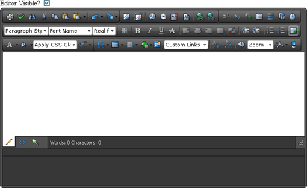

# set_visible


## 

Sets the RadEditor visible on the client.


>caption  

|  **function**  **set_visible (isVisible)**  |  |  |
| ------ | ------ | ------ |
| **isVisible** | **boolean** |If **true** RadEditor will be visible on the client.|

The following example places a standard ASP checkbox input control on the form to toggle RadEditor visibility.
>caption 



In the form's declaration, the checkbox input control references a "myCheckboxClick()" method called each time the checkbox is toggled.

````ASPNET
	Editor Visible?
	<input type="checkbox" id="myCheckBox" checked="checked" onclick="myCheckboxClick()" />
	<telerik:RadEditor ID="RadEditor1" runat="server">
	</telerik:RadEditor>
````


In the script for the checkbox click handler, you can [return a reference to the RadEditor client object](), get a reference to the checkbox DOM object, then call set_visible() passing the current checkbox "checked" value:

````ASPNET
	<telerik:RadScriptBlock ID="RadScriptBlock1" runat="server">
	   <script type="text/javascript">
	   	function myCheckboxClick() {
	   		//get a reference to RadEditor client object
	   		var editor = $find("<%=RadEditor1.ClientID%>");
	   		var isChecked = document.getElementById("myCheckBox").checked;
	   		editor.set_visible(isChecked);
	   	}        
	   </script>
	</telerik:RadScriptBlock> 
````


