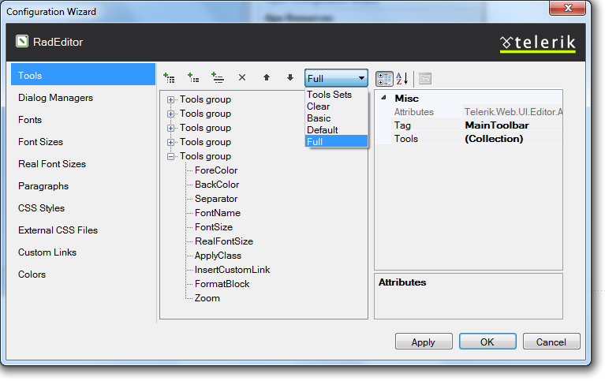
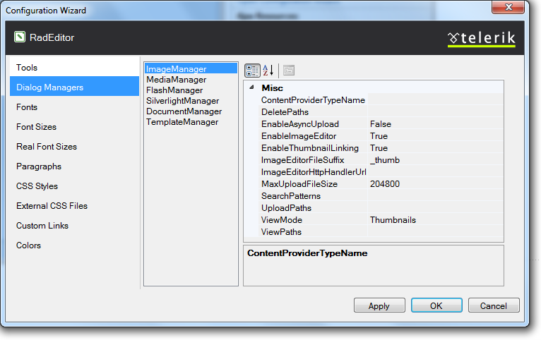

# Configuration Wizard

The Smart Tag of **RadEditor** lets you easily configure your control or quickly get help. You can display the Smart Tag by right clicking on a **RadEditor** control and choosing "Show Smart Tag", or clicking the small rightward-pointing arrow located in the upper right corner of the control.

## Tools

From the [Tools]() tab you could define which Tool Group to be visible in the Editor, as well to create your own set of Tools:

## Dialog Managers

From the [Dialog Managers]() tab you could enable/disable the desired dialogs and to manage their properties' values:

## Fonts

From the [Fonts]() tab you could define the fonts which would be shown in the RadEditor's Fonts dropdown. By default the RadEditor displays a predefined set of fonts which by default are: Arial, Comic Sans MS, Courier New, Tahoma, Times New Roman and Verdana. You are able as well to create a new set of dropdown Font name items:

## Font Sizes

From the [Font Sizes]() tab you could repopulate the Font Size dropdown with the sizes from 1 to 7 (these are the browser supported values):

## Real Font Sizes

From the [Real Font Sizes]() tab you could repopulate Real Font Sizes dropdown, which displays a predefined set of font sizes in pixels and points:

## Paragraphs

From the [Paragraphs]() tab you could manage the styles which to be shown in the Paragraph style dropdown:

## CSS Styles

From the [CSS Styles]() tab you could manage which CSS classes to be shown in the ApplyClass dropdown.

## External CSS Files

From the [External CSS Files]() tab you could modify the CSS set of external files which will be loaded in the Content area of the RadEditor:

## Custom Links

From the [Custom Links]() tab you could populate the Custom Links dropdown with pre-defined hyperlinks:

## Colors

In the [Colors]() tab you could manage the predefined set of colors, shown in theFore and Back color dropdowns:

