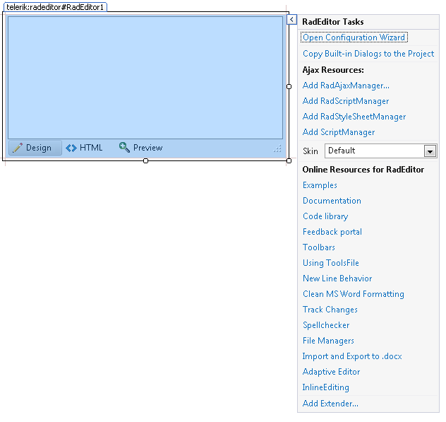

# Smart Tag

The Smart Tag of **RadEditor** lets you configure your control or quickly get help. You can display	the Smart Tag by right clicking on a **RadEditor** control and choosing "Show Smart Tag",or clicking the small rightward-pointing arrow located in the upper right corner of the control. You can see how the Smart Tag opened in **Figure 1**.
>caption Figure 1: Shows the opened Smart Tag

## Configuration Wizard

**Open** opens the wizard where you could configure RadEditor's:

* **Tools**

* **Dialog Managers**

* **Fonts**

* **Font Sizes**

* **Real Font Sizes**

* **Paragraphs**

* **CSS Styles**

* **External CSS Files**

* **Custom Links**

* **Colors**

## Ajax Resources

* **Add RadAjaxManager...** adds a **RadAjaxManager** component to your Web page, and displays the **RadAjax Property Builder** where you can configure it.

* **Add RadStyleSheetManager** adds a **RadStyleSheetManager** to your Web page.

## Skin

The **Skin** drop-down displays a list of available [skins]() that you can apply to your control, along with an example of what the **RadDock** control looks like for each skin. Assign a skin by selecting the one you want from the list.

## Copy Built-in Dialogs to the Project

Gets the User Control files of the RadEditor built-in dialogs from the used Telerik UI for ASP.NET AJAX suite andadds them into the project RadEditorDialogs folder.Additionally [the ExternalDialogsPath property]() is set with the path to this folder.

>warning Note that this option will override the already existing files in the RadEditorDialogs folder.If additional dialog customizations are done, it is recommended to backup the files before this action.
>

## Learning Center

* Links navigate you directly to examples, help, and code library.

* You can also search the Telerik web site for a given string.

* You can navigate directly to the [Telerik Support Center](http://www.telerik.com/support/home.aspx).
