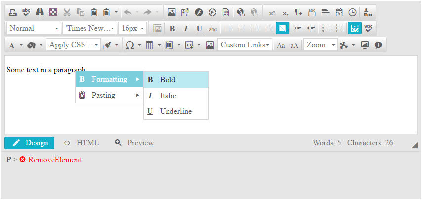

# Nested Context Menus

In this help article, you will learn how you can configure **RadEditor** with nested context menus.

The capability to nest the context menus in **RadEditor** is available as of **R2 2016** and it is supported only for [Lightweight rendering]().

With the new feature, the `Tools` collection of the `EditorContextMenu` class supports a new item — `EditorContextMenuTool`. You can use its `Tools` collection to add additional tools (`EditorTool` items) that will be in the nested menu. 

The `EditorContextMenuTool` class can be edited by using the:

* `Name` property to edit the text of the tool that opens the nested menu.
* `IconCssClass` property to add a class name to the icon element in order to style it with CSS later.

You can also configure multilevel nesting, as shown in **Example 3**.

>caption Figure 1: RadEditor with configured nested context menus from Example 1.



>caption Example 1: Configuring nested context menus.

````ASP.NET
<telerik:RadEditor runat="server" ID="RadEditor1" RenderMode="Lightweight">  
    <Content>
       <p>Some text in a paragraph.</p>
    </Content>
    <ContextMenus>
        <telerik:EditorContextMenu TagName="P">
            <telerik:EditorContextMenuTool Name="Formatting" IconCssClass="reBold">
                <Tools>
                    <telerik:EditorTool Name="Bold" />
                    <telerik:EditorTool Name="Italic" />
                    <telerik:EditorTool Name="Underline" />
                </Tools>
            </telerik:EditorContextMenuTool>
            <telerik:EditorContextMenuTool Name="Pasting" IconCssClass="rePaste">
                <Tools>
                    <telerik:EditorTool Name="Cut" />
                    <telerik:EditorTool Name="Copy" />
                    <telerik:EditorTool Name="Paste" />
                </Tools>
            </telerik:EditorContextMenuTool>
        </telerik:EditorContextMenu>
    </ContextMenus>
</telerik:RadEditor>
```` 

>caption Example 2: Configuring nested context menus from the code behind. 

````ASP.NET
<telerik:RadEditor runat="server" ID="RadEditor1" RenderMode="Lightweight">
    <Content>
       <p>Some text in a paragraph.</p>
    </Content>
</telerik:RadEditor>
````

````C#
EditorContextMenuTool formattingMenu = new EditorContextMenuTool("Formatting");
formattingMenu.IconCssClass = "reBold";

formattingMenu.Tools.Add(new EditorTool("Bold"));
formattingMenu.Tools.Add(new EditorTool("Italic"));
formattingMenu.Tools.Add(new EditorTool("Underline"));

EditorContextMenuTool pastingMenu = new EditorContextMenuTool("Pasting");
pastingMenu.IconCssClass = "rePaste";

pastingMenu.Tools.Add(new EditorTool("Cut"));
pastingMenu.Tools.Add(new EditorTool("Copy"));
pastingMenu.Tools.Add(new EditorTool("Paste"));

EditorContextMenu myContextMenu = new EditorContextMenu();
myContextMenu.TagName = "P";

myContextMenu.Tools.Add(formattingMenu);
myContextMenu.Tools.Add(pastingMenu);

RadEditor1.ContextMenus.Add(myContextMenu);
````
````VB
Dim formattingMenu As New EditorContextMenuTool("Formatting")
formattingMenu.IconCssClass = "reBold"

formattingMenu.Tools.Add(New EditorTool("Bold"))
formattingMenu.Tools.Add(New EditorTool("Italic"))
formattingMenu.Tools.Add(New EditorTool("Underline"))

Dim pastingMenu As New EditorContextMenuTool("Pasting")
pastingMenu.IconCssClass = "rePaste"

pastingMenu.Tools.Add(New EditorTool("Cut"))
pastingMenu.Tools.Add(New EditorTool("Copy"))
pastingMenu.Tools.Add(New EditorTool("Paste"))

Dim myContextMenu As New EditorContextMenu()
myContextMenu.TagName = "P"

myContextMenu.Tools.Add(formattingMenu)
myContextMenu.Tools.Add(pastingMenu)

RadEditor1.ContextMenus.Add(myContextMenu)
````

>caption Example 3: Multilevel nesting in context menus.

````ASP.NET
<telerik:RadEditor runat="server" ID="RadEditor1" RenderMode="Lightweight">
    <Content>
       <p>Some text in a paragraph.</p>
    </Content>
    <ContextMenus>
        <telerik:EditorContextMenu TagName="P">
            <telerik:EditorContextMenuTool Name="Formatting" IconCssClass="reBold">
                <Tools>
                    <telerik:EditorContextMenuTool Name="Allignment">
                        <Tools>
                            <telerik:EditorTool Name="JustifyLeft" />
                            <telerik:EditorTool Name="JustifyCenter" />
                            <telerik:EditorTool Name="JustifyRight" />
                            <telerik:EditorTool Name="JustifyFull" />
                            <telerik:EditorTool Name="JustifyNone" />
                        </Tools>
                    </telerik:EditorContextMenuTool>
                    <telerik:EditorTool Name="Bold" />
                    <telerik:EditorTool Name="Italic" />
                    <telerik:EditorTool Name="Underline" />
                </Tools>
            </telerik:EditorContextMenuTool>
            <telerik:EditorContextMenuTool Name="Pasting" IconCssClass="rePaste">
                <Tools>
                    <telerik:EditorTool Name="Cut" />
                    <telerik:EditorTool Name="Copy" />
                    <telerik:EditorTool Name="Paste" />
                </Tools>
            </telerik:EditorContextMenuTool>
        </telerik:EditorContextMenu>
    </ContextMenus>
</telerik:RadEditor>

````


## See Also

* [Context Menus Overview]()
* [Render Modes]()
