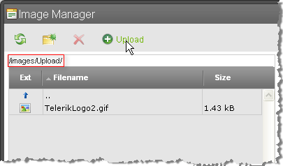

# Enable Tabs


## 

__TASK__

Enable __Upload Image__ tab of the [Image Manager]() dialog.

>tip example holds true for[Documents](),[Flash]()and[Media](), too, when setting the correspondent properties.
>


__SOLUTION__

To use the Upload tab of the image dialog you would need to set two properties: __ImageManager.ViewPaths__ and __ImageManager.UploadPaths__. These properties should point to the folders where the files will reside on the server. Here's an examplethat assumes you have a "mypics" and "mypics/upload" directories in your web application root folder:

````ASPNET
	    <telerik:RadEditor runat="server" ID="RadEditor1">
	        <ImageManager ViewPaths="~/mypics" UploadPaths="~/mypics/upload" />
	    </telerik:RadEditor>
````


In addition, the Upload tab will remain disabled if the path is wrong or the __UploadImagesPaths__folder does not exist.

>note Note that the mypics variable is an array of strings and that the Images folder must be:
>
* a subdirectory of your web application or
* a virtual directory of your web application that has a physical path pointing outside of your web application.
* a shared drive that is a virtual folder of your web application.>You should also grant full __ASPNET__ (WinXP) / __NETWORK SERVICE__ (Win 2003 and Vista) account permissions to the Images Folders.
>


Once these conditions are met, you can open the Images dialog. If you have images in the "mypics" directory, you will see them. Select the directory where you want to upload new images. The UPLOAD tab should become active. Click on it and upload the image.
>caption 



# See Also

 * [Adding Custom Dialogs](http://demos.telerik.com/aspnet/prometheus/Editor/Examples/CustomDialogs/DefaultCS.aspx)
