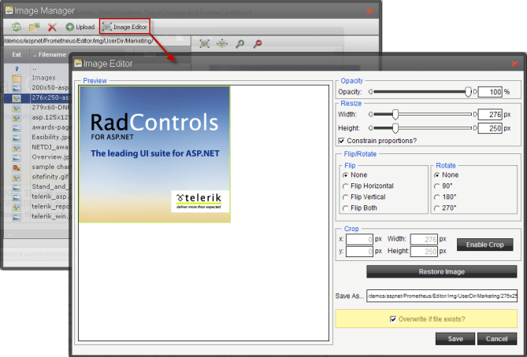

# Images


## 

__Functionality:__

Using the Image Manager dialog the users of RadEditor can:

* __insert images__ in the editor's content area

* __upload new images__, which will be available for inserting.

* __delete images__

__Properties to set:__

The behavior of the Image Manager dialog is controlled by the following properties:

>note Starting from Q1 2012, the Image Manager has a new default thumbnail mode, which shows the files as icons in the central area of the dialog. The old grid mode can be restored by setting the ViewMode property to "Grid".
>


>caption  

|  __Property__  |  __Description__  |
| ------ | ------ |
| __ViewMode__ |Gets or sets the ExplorerMode of the FileExplorer that handles the file browsing of the ImageManager. Default is Thumbnail.|
| __ViewPaths__ |A string array which contains the paths where the RadEditor will look for images. The default value is an empty array. These folders will be visible in the file browser part of the dialog.|
| __UploadPaths__ |A string array which contains the paths to which the RadEditor will be able to upload images. The default value is an empty string array. The elements of this array must be a subset of the ViewPaths array.|
| __DeletePaths__ |A string array which contains the paths from which the RadEditor will be able to delete images. The default value is an empty string array. The elements of this array must be a subset of the ViewPaths array.|
| __MaxUploadFileSize__ |The maximum image file size in bytes, allowed for uploading. The default value is __204800__ bytes (200 kilobytes).|
| __SearchPatterns__ |A string array which contains the file extension filters that controls which files are shown in the Image Manager dialog and which file types can be uploaded through the upload dialog.The * character can be used as a wildcard in the file name, for example __*.jpg__ will match all image names with extension jpg.|

In order for a folder to be visible in the file browser, it must be present in the ViewPaths array. The users will be able to browse its subfolders since they inherit the permissions. If it is needed to grant permission for deleting or uploading images into a specific folder, it must be present in the corresponding array - DeletePaths or UploadPaths. These permissions are also inherited by the subfolders.The application root folder can be substituted with the "~" (tilde) character. It is possible to use paths relative to the root. For example, in order to access images located in another web application.

__Example:__

The example below demonstrates the relationship between the folder structure and the property settings:

With the settings above, the users will be able to browse all subfolders of the "~/images" folder. They will be able to upload images to the "~/Images/New" folder and all its subfolders and delete images from "~/Images/New/Articles" and "~/Images/New/News".__Setting Image manager properties inline:__

````XML
	    <telerik:RadEditor runat="server" ID="RadEditor1">
	        <ImageManager ViewPaths="~/Images" UploadPaths="~/Images/New" DeletePaths="~/Images/New/Articles,~/Images/New/News" />
	    </telerik:RadEditor>
````


__Setting Image manager properties in CodeBehind:__


````C#
	
	        string[] viewImages = new string[] { "~/Images" };
	        string[] uploadImages = new string[] { "~/Images/New" };
	        string[] deleteImages = new string[] { "~/Images/New/Articles", "~/Images/New/News" };
	
	        if (!IsPostBack)
	        {
	            RadEditor1.ImageManager.ViewPaths = viewImages;
	            RadEditor1.ImageManager.UploadPaths = uploadImages;
	            RadEditor1.ImageManager.DeletePaths = deleteImages;
	            //to change the View mode to Grid use the below syntax
	            RadEditor1.ImageManager.ViewMode = Telerik.Web.UI.Editor.DialogControls.ImageManagerViewMode.Grid;
	        } 
	
````
````VB
	
	        Dim viewImages As String() = New String() {"~/Images"}
	        Dim uploadImages As String() = New String() {"~/Images/New"}
	        Dim deleteImages As String() = New String() {"~/Images/New/Articles", "~/Images/New/News"}
	
	        If Not IsPostBack Then
	            RadEditor1.ImageManager.ViewPaths = viewImages
	            RadEditor1.ImageManager.UploadPaths = uploadImages
	            RadEditor1.ImageManager.DeletePaths = deleteImages
	            'to change the View mode to Grid use the below syntax
	            RadEditor1.ImageManager.ViewMode = Telerik.Web.UI.Editor.DialogControls.ImageManagerViewMode.Grid
	        End If
	
````


Note that the viewImages, uploadImages and deleteImages variables are string arrays and that the Images folders must be:

* a subdirectory of your web application

* directory placed in the root of IIS - you can set this folder by using the / forward slash symbol, e.g.RadEditor1.ImageManager.ViewPaths = new String []{"/Images"};

* a virtual directory of your web application that has a physical path pointing outside of your web application.

>note You should also grant full ASPNET account permissions over the Images Folders on Win XP computers with IIS 5.1. On Win 2003 servers with IIS 6.0 you should grant full NETWORK SERVICE account permissions over the Images Folder.
>


>note The Images inserted via the ImageManager have __relative paths__ . In scenarios when __absolute paths__ are needed enable the __MakeUrlsAbsolute__ client-side filter of RadEditor:
>
* via the codebehind: RadEditor1.EnableFilter(EditorFilters. __MakeUrlsAbsolute__ );
* inline: <telerik:RadEditor ID="RadEditor1" __ContentFilters="MakeUrlsAbsolute"__ runat="server" />>


The __Image manager__ offers a new feature named __Image Editor__, which provides the ability to resize, flip, rotate, crop, rename the selected image element as well as set its opacity:
>caption 



# See Also

 * [Set Properties]()

 * [Enforce Roles]()

 * [File Managers](http://demos.telerik.com/aspnet/prometheus/Editor/Examples/FileManagers/DefaultCS.aspx)

 * [Adding Custom Dialogs](http://demos.telerik.com/aspnet/prometheus/Editor/Examples/CustomDialogs/DefaultCS.aspx)

 * [Upload Large Files (maxRequestLength)]()

 * [Upload Images to the Server]()

 * [Uploading images and files to a Shared Drive](http://www.telerik.com/support/kb/aspnet-ajax/editor/uploading-images-and-files-to-a-shared-drive.aspx)

 * [Using the Image and Document managers outside RadEditor](http://www.telerik.com/support/kb/aspnet-ajax/editor/using-the-image-and-document-managers-outside-radeditor.aspx)

 * [Content Filters]()
