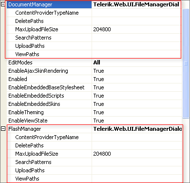

# File Browser Dialogs Overview

RadEditor dialogs are used to insert objects into the content area. These "FileBrowser" dialogs are the Image Manager, Flash Manager, Document Manager, Media Manager, Silverlight Manager and Template Manager dialogs.

The FileBrowser dialogs consist of a FileBrowser object, an object previewer/property manager and a file uploader tab. The FileBrowser provides the ability to browse directories and locate a file item. Selected file items are loaded into the previewer.

The files which will be available in a FileBrowser dialog are controlled by a set of properties for each type of dialog:



All dialogs have the ViewPaths, UploadPaths and deletePaths properties in common which can be set in the dialog tag:

* **ViewPaths** - Specifies the paths where files are located. The FileBrowser dialog displays recursively all the subdirectories and the appropriate files.

* **UploadPaths** - Specifies the paths to which users can upload files. To be visible, these paths should be a subset (or child paths) of a **ViewPaths** value.

* **DeletePaths** - Specifies the paths from which users can delete files. To be visible, these paths should be a subset (or child paths) of a **ViewPaths** value.

The example below shows **ViewPaths** in the parent "/Images" directory, **UploadPaths**located in a "/New" subdirectory and **DeletePaths** with two paths under "/New". This set of paths is defined for each of the FileBrowser dialogs:

````ASP.NET
<telerik:RadEditor runat="server" ID="RadEditor1">
	<ImageManager ViewPaths="~/Images" UploadPaths="~/Images/New" DeletePaths="~/Images/New/Articles,~/Images/New/News" />
	<MediaManager ViewPaths="~/Images" UploadPaths="~/Images/New" DeletePaths="~/Images/New/Articles,~/Images/New/News" />
	<FlashManager ViewPaths="~/Images" UploadPaths="~/Images/New" DeletePaths="~/Images/New/Articles,~/Images/New/News" />
	<TemplateManager ViewPaths="~/Images" UploadPaths="~/Images/New" DeletePaths="~/Images/New/Articles,~/Images/New/News" />
	<DocumentManager ViewPaths="~/Images" UploadPaths="~/Images/New" DeletePaths="~/Images/New/Articles,~/Images/New/News" />
	<SilverlightManager ViewPaths="~/Images" UploadPaths="~/Images/New" DeletePaths="~/Images/New/Articles,~/Images/New/News" />
</telerik:RadEditor>
````

* **SearchPatterns**—specifies the extensions of the files displayed by the FileBrowser dialog.

* **MaxUploadFileSize**—controls the maximum allowed file size of a FileBrowser dialog.

When in a folder not having upload rights, the Upload tab is disabled. The Create New Folder operation is disabled as well. When in a folder not having delete rights, the Delete button is disabled. Security rights setting is explained in the [Example: Enforcing Roles]() topic.

>note The relative path syntax is not currently supported, because RadEditor uses the so-called FileBrowserContentProvider abstraction which allows for the editor dialogs to be hooked into various CMS systems and/or databases.

The default implementation of the FileBrowserContentProvider has no notion of Page - hence, it is not able to determine in which context the relative path should be resolved in. E.g. here is some code from the provider:

````C#
public override DirectoryItem ResolveRootDirectoryAsTree(string path)
{ 
	/* No Page object here, just HttpContext object here
	string physicalPath = Context.Server.MapPath(path); ...
	Hence, the easiest way to "feed" relative paths to the editor is not declarative, but uses a little bit of code, e.g.: */
	
	string path = **Page.ResolveUrl**("./images");
}
````


