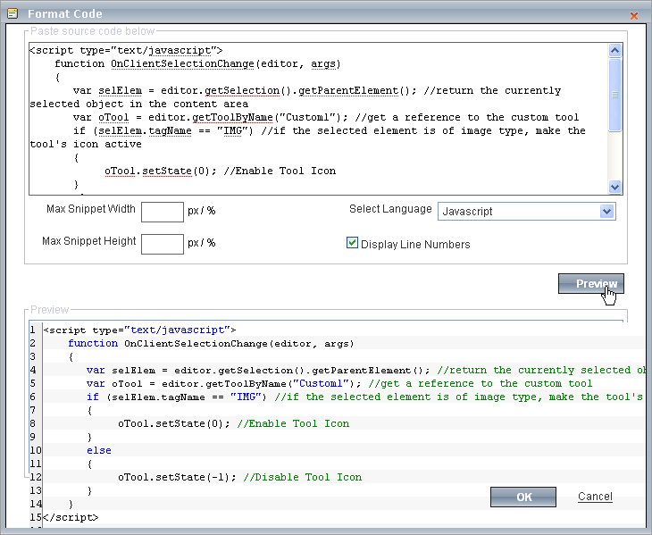

# Format Code Block

The RadEditor **Format Code Block Dialog** provides the ability to edit and format code blocks of:

* Markup, i.e. HTML, XHTML, ASPX, XML
* CSS
* JavaScript
* C#
* VB code blocks
* PHP
* Delphi
* Python
* SQL

Click the **Format Code** button, paste lines of text or code into the upper pane of the **Format Code** dialog, then select the format from the **Select Language** dropdown and finally click the **OK** button to insert the formatted content into the editor. The dialog also provides a **Preview** button which allows you to see how the formatted content will look (depending on the selected Language item in the dropdown) before insertion into the content area.

To place the Format Code Block tool in the editor toolbar, you can add the FormatCodeBlock to the Tools collection at design-time or place the following ToolsFile declaration tag:

````XML
<tool name="FormatCodeBlock" />      
````

You can see a sample dialog preview below, which shows formatted content prior to insertion in the content area:


