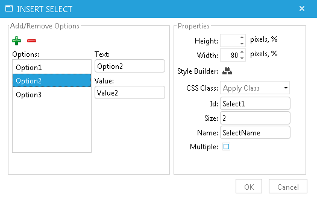

# Insert Select Element

## 

**Insert Select dialog** offers a way to easily create or edit **<select>**dropdowns in RadEditor. It consists of two panels - the first one is for **adding and removing options elements** while the second one is for **setting up the properties** of the drop-down list:

**Add/Remove Options** Panel:

* **Add Option** - Adds an option element to the drop-down list

* **Remove Option** - Removes an option element from the drop-down list

* **Options** - Shows the list of the options elements

* **Text** - Sets/Gets the text for selected option element from the Options field

* **Value** - Sets/Gets the value for selected option element from the Options field.

**Properties** Panel:

* **Width/Height** - Specifies the height and the width of the drop-down list (in pixels or percent)

* **Style builder** - Opens another dialog that allows for fine tuningthe appearance of the drop-down list (e.g. borders, alignment, spacing, etc.)

* **CSS Class** - Specifies Select CSS class and style. This property should be used only by advanced users

* **Id** - Defines the ID attribute for the drop-down list

* **Size** - Specifies the number of visible options in the drop-down list

* **Name** - Defines a name for the drop-down list

* **Multiple** - Specifies that multiple options can be selected at once.
