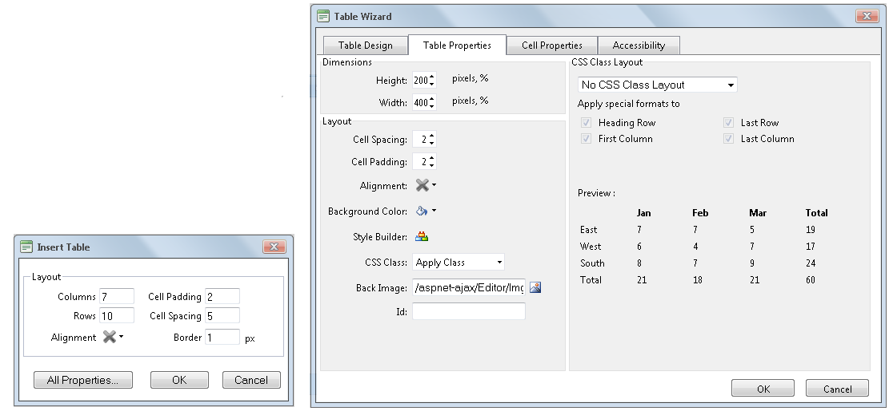

# Lightweight Insert Dialogs

## Light Dialogs

A light version of the three most used dialogs are currently present in RadEditor toolbar:

* **Insert Link Dialog** - the lighter version of the **Hyperlink Manager**.

* **Insert Image** - the lighter version of the **Image Manager** with Image Editor.

* **Insert Table** - the lighter version of the **Table Wizard**.

The usual Window Dialog is opened into an IFRAME tag and that means more HTML, more CSS, loading a new page.Several otherTelerik controls from the ASP.NET AJAX suite are used to render the window dialogs such as **RadFileExplorer**, **RadFormDecorator**, **RadTabStrip**. That loads more HTML and CSS that decreases the general performance of the control.

The rendered HTML and CSS in the Light Dialog code is lighter; it is loaded on the same page and is much faster.It does not support all the properties that are supported by the Window Dialog, but supports the most important of them. You can find these two new light dialogs in the toolbar. The icons that open these dialogs look the same way as the usual dialog icons but with a small plus (+) sign in the top right corner for Insert Link Dialog, in the top left corner for Insert Image andInsert Table Dialogs:

## Insert Link Light Dialog

The **Insert Link** dialog is a light version of the **Hyperlink Manager**. When enabled, its content is rendered on page load and as a result, the content is immediately shown when the dialog is opened,while Hyperlink Manager is loaded into an IFRAME tag and is much heavier. In order to have it decorated you should put a **RadFormDecorator** on the main page.

The **Insert Link** light dialog has the most important properties to put a hyperlink in your document: **URL**, **Link Text** and **Target**. In the light dialog you also have a button (**All Properties…**) that allows you to switch from Insert Link dialog to Hyperlink Manager dialog if you need to access all hyperlink options.:

## Insert Image Light Dialog

The **Insert Image** dialog is a light version of **ImageManager** with ImageEditor. When enabled, its content is rendered on page load and as a result, the content is immediately shown when the dialog is opened, while ImageManager with ImageEditor is loaded into an IFRAME tag and is much heavier. In order to have it decorated you should put a **RadFormDecorator** on the main page.

The **Insert Image** light dialog has the most important properties to put an image into your document: **Image Source, Alt Text, Width** and **Height**. In the light dialog you also have a button (**All Properties…**) that allows you to switch from Insert Image dialog to ImageManager with ImageEditor dialog if you decide you want to access all image properties options.

## Insert Table Light Dialog

The **Insert Table** dialog is a light version of **Table Wizard**. When enabled, its content is rendered on page load and as a result, the content is immediately shown when the dialog is opened, while Table Wizard is loaded into an IFRAME tag and is much heavier. In order to have it decorated you should put a **RadFormDecorator** on the main page.

The **Insert Table** light dialog has the most important properties to insert a table into your document: **Columns, Rows, Alignment, Cell Padding, Cell Spacing** and **Border**. In the light dialog you also have a button (**All Properties…**) that allows you to switch from Insert Table dialog to Table Wizard dialog if you decide you want to access all table properties options.

