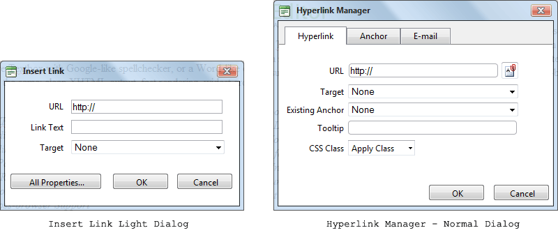

# Lightweight Insert Dialogs

## Light Dialogs

A light version of the three most used dialogs are currently present in RadEditor toolbar:

* __Insert Link Dialog__ - the lighter version of the __Hyperlink Manager__.

* __Insert Image__ - the lighter version of the__Image Manager__with Image Editor.

* __Insert Table__ - the lighter version of the __Table Wizard__.

The usual Window Dialog is opened into an IFRAME tag and that means more HTML, more CSS, loading a new page.Several otherTelerik controls from the ASP.NET AJAX suite are used to render the window dialogs such as __RadFileExplorer__, __RadFormDecorator__, __RadTabStrip__. That loads more HTML and CSS that decreases thegeneral performance of the control.

The rendered HTML and CSS in the Light Dialog code is lighter; it is loaded on the same page and is much faster.It doesnot support all the properties that are supported by the Window Dialog, but supports the most important of them. You can findthese two new light dialogs in the toolbar. The icons that open these dialogs look the same way as the usual dialog icons butwith a small plus (+) sign in the top right corner for Insert Link Dialog, in the top left corner for Insert Image andInsert Table Dialogs:

## Insert Link Light Dialog

The __Insert Link__dialog is a light version of the __Hyperlink Manager__. Whenenabled, its content is rendered on page load and as a result, the content is immediately shown when the dialog is opened,while Hyperlink Manager is loaded into an IFRAME tag and is much heavier. In order to have it decorated you shouldput a __RadFormDecorator__ on the main page.

The __Insert Link__ light dialog has the most important properties to put a hyperlink in yourdocument: __URL__, __Link Text__ and __Target__. In thelight dialog you also have a button (__All Properties…__) that allows you to switch from Insert Linkdialog to Hyperlink Manager dialog if you need to access all hyperlink options.:

## Insert Image Light Dialog

The __Insert Image__ dialog is a light version of __ImageManager__withImageEditor. When enabled, its content is rendered on page load and as a result, the content is immediately shown whenthe dialog is opened, while ImageManager with ImageEditor is loaded into an IFRAME tag and is much heavier. In order tohave it decorated you should put a __RadFormDecorator__ on the main page.

The __Insert Image__ light dialog has the most important properties to put an image into yourdocument: __Image Source, Alt Text, Width__ and __Height__. In the lightdialog you also have a button (__All Properties…__) that allows you to switch from Insert Imagedialog to ImageManager with ImageEditor dialog if you decide you want to access all image properties options.

## Insert Table Light Dialog

The __Insert Table__ dialog is a light version of __Table Wizard__.When enabled, its content is rendered on page load and as a result, the content is immediately shown whenthe dialog is opened, while Table Wizard is loaded into an IFRAME tag and is much heavier. In order tohave it decorated you should put a __RadFormDecorator__ on the main page.

The __Insert Table__ light dialog has the most important properties to inseart a table into yourdocument: __Columns, Rows, Alignment, Cell Padding, Cell Spacing__ and __Border__.In the light dialog you also have a button (__All Properties…__) that allows you to switchfrom Insert Table dialog to Table Wizard dialog if you decide you want to access all table properties options.

