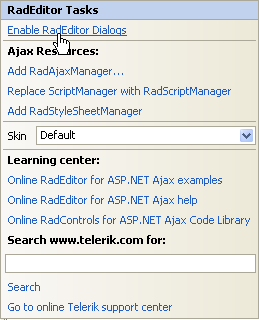

# Dialogs Overview

RadEditor offers FileBrowser dialogs such as

* Image Manager

* Flash Manager

* Silverlight Manager

* Document Manager

* HyperlinkManager

* Media Manager

* Template Manager

The RadEditor FileBrowser dialogs are mainly used to insert objects in the content area. These are the Image Manager, Flash Manager, Document Manager, Media Manager and Template Manager dialogs. The FileBrowser dialogs also provide the ability to upload and delete files and directories. You can find more information about the File Browser dialogs in the following article: [File Browser Dialogs]().

These dialogs are enabled by default. Dialog visibility can be toggled using the [ToolsFile.xml]() or by populating the RadEditor Tools collection.

RadEditor offers FileBrowser dialogs such as ImageManager, FlashManager and DocumentManager as well as others such as the HyperlinkManager, the About and Help dialogs.

To enable dialogs, use the Smart Tag **Enable RadEditor Dialogs** option.



Running the Smart Tag option will add the following web.config HttpHandler entry:

>caption web.config sample

````XML
<httpHandlers>  
	...  
	<add path="Telerik.Web.UI.DialogHandler.aspx" verb="*" type="Telerik.Web.UI.DialogHandler" validate="false" />
</httpHandlers>
...
<system.webServer>    
	<handlers>      
		...      
		<add name="Telerik_Web_UI_DialogHandler_aspx" verb="*" preCondition="integratedMode" path="Telerik.Web.UI.DialogHandler.aspx" type="Telerik.Web.UI.DialogHandler" />    
	</handlers>  
</system.webServer>
````

>tip You can find the full list of the required and optional web.config settings is available in the [web.config Settings Overview]() article.

As of **Q2 2015**, new phone-optimized UI is introduced in **RadEditor**—[Phone Layout of RadEditor](). You can find more details about the dialog-related optimizations in the [Mobile Dialogs]() article.    

## See Also

* [File Browser Dialogs]()

* [web.config Settings Overview]()

* [Phone Layout of RadEditor]()

* [Phone Layout Getting Started]()

* [Phone Layout Elements Structure]()

* [Mobile Dialogs]()
