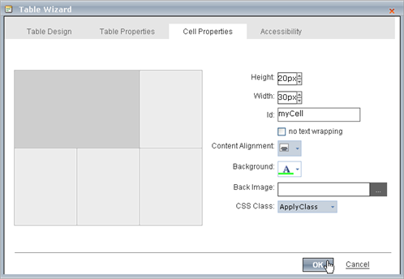
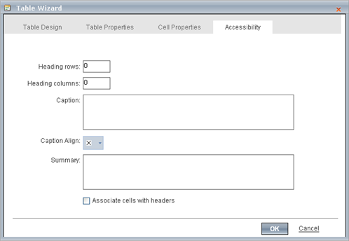

# Table Wizard

The Table Wizard provides advanced features for creating and customizing tables in the editor's content area. The Table Wizard is a dialog with tabs for detailed table design: **Table Design**, **Table Properties**, **Cell Properties** and **Accessibility.**The Table Wizard can be invoked using the **Insert Table Dropdown.**

## Table Design

This tab allows you to adjust the number of rows and columns, and adjust the row and column span.
>caption 

## Table Properties

This tab allows you to configure table dimensions and layout by setting one or more of the following table properties:

* **Width/Height** - Specifies the height and the width of the table (in pixels or percent).

* **ID -**Setting an ID for a table gives some options for advanced table handling.

* **CSS Class**- Specifies table CSS class and style. This property should be used only by advanced users**.**

* **Background Color -** Sets the background color of the table.

* **Background Image -** Sets an image as the table background.

* **Alignment -** Aligns the table to the left, center or right side of the page.

* **Cell spacing** - Increases or decreases the space between the borders of the cells.

* **Cell padding** - Increases or decreases the space between the content and the border of a cell.

* **Borders** - Includes setting border width, color, and layout.
>caption 

## Cell Properties

The Cell Properties tab allows you to fine-tune the appearance of individual cells of a given table. Here you can configure cell width, height, alignment, background, the cell ID, toggle text wrapping and set the CSS class for a given cell.
>caption 

## Accessibility

The Accessibility tab allows you to adjust the number of heading rows and columns, add caption settings, add a summary and to toggle if the cells are associated with the headers.
>caption 

