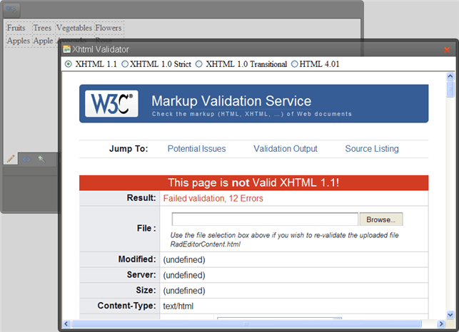

# XHTML Validator

The **XhtmlValidator**dialog uses the W3C XHTML Validator Page to perform validation of the current editor content. The W3C service returns a compliance report right within the editor dialog. This feature eliminates the need for manual copy/pasting of the HTML and validation in a separate browser window.



You can enable this dialog by declaring the XhtmlValidator Tool in-line, adding it to the ToolsFile.xml or defining it programmatically:

````ASP.NET
<telerik:radeditor id="RadEditor1" runat="server" skin="Default">    
	<Tools>        
		<telerik:EditorToolGroup>            
			<telerik:EditorTool Name="XhtmlValidator" Text="Xhtml Validator Dialog" />        
		</telerik:EditorToolGroup>    
	</Tools>
</telerik:radeditor>
````

````XML
<root>  
	<tools name="Main" >    
		<tool name="XhtmlValidator" />  
	</tools>
</root>
````


````C#
// Remove default tools
RadEditor1.Tools.Clear();
// Create a new tool group and add to RadEditor Tools collection
EditorToolGroup group = new EditorToolGroup();
RadEditor1.Tools.Add(group);
// Create the XhtmlValidator tool and add it to the tool group
EditorTool tool = new EditorTool("XhtmlValidator");
group.Tools.Add(tool);   
````
````VB
' Remove default tools
RadEditor1.Tools.Clear()
' Create a new tool group and add to RadEditor Tools collection
Dim group As New EditorToolGroup()
RadEditor1.Tools.Add(group)
' Create the XhtmlValidator tool and add it to the tool group
Dim tool As New EditorTool("XhtmlValidator")
group.Tools.Add(tool) 			
````


