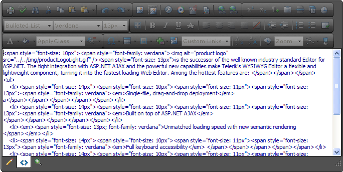

# Edit Modes


## Changing Editor Modes

RadEditor offers three different edit modes Design, Html and Preview:

* **Design:**In the Design mode you can edit and format the content by using the RadEditor toolbar buttons, dropdowns and dialogs.

* **Html**: HTML mode provides direct access to the content HTML . This mode is used most often by advanced users.

* **Preview**: Shows how the content will look like before updating the page.

**Design mode**:
>caption 


**Html mode**:More advanced users sometimes need to modify the HTML code of the content directly. The HTML mode provides access to the HTML markup for fine-grain control.
>caption 



**Preview mode**:After editing your document in the editor preview, users may like to see how the page looks like before updating the page. The editor can be switched to the Preview Mode just by a single click of the preview button
>caption 


## Using the EditModes Enumeration

You can also control the displaying of the Design, Html and Preview buttons by using the **EditModes**enumeration property.**Example 1**: Display only the Design and Preview modes (configure the editor inline or in the codebehind):

````ASPNET
	    <telerik:RadEditor runat="server" ID="RadEditor1" EditModes="Design,Preview">
	    </telerik:RadEditor>
````


````C#
	     
			RadEditor1.EditModes = EditModes.Design | EditModes.Preview; 
				
````
````VB
	
	        RadEditor1.EditModes = EditModes.Design Or EditModes.Preview
	
````


**Example 2**: Display the Html mode only (configure the editor inline or in the codebehind):

````ASPNET
	    <telerik:RadEditor runat="server" ID="RadEditor1" EditModes="Html">
	    </telerik:RadEditor>
````


````C#
	
	        RadEditor1.EditModes = EditModes.Html;
	
````
````VB
	
	        RadEditor1.EditModes = EditModes.Html
	
````


# See Also

 * [Edit Modes](http://demos.telerik.com/aspnet/prometheus/Editor/Examples/EditModes/DefaultCS.aspx)
