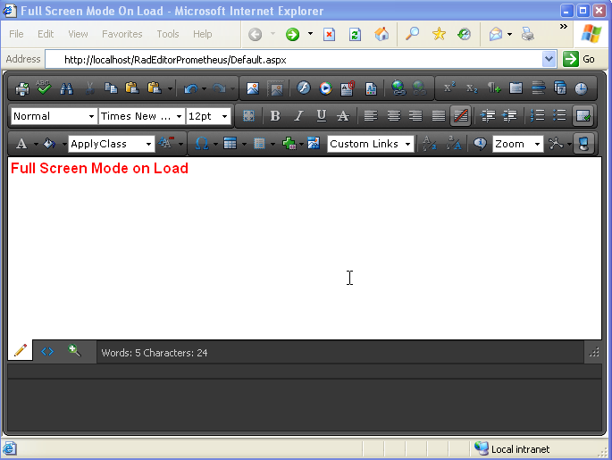

# Full Screen Mode

As the name implies, the Full Screen Mode feature of RadEditor for ASP.NET AJAX allows you to view the editor as you would in a normal fullscreen window.



If you would like to open the editor in full screen mode when the page is loaded, you can use the editor's Fire client-side method to fire the ToggleScreenMode command as shown below:

````ASP.NET
<script type="text/javascript">
	function OnClientLoad(editor, args)
	{
		editor.fire("ToggleScreenMode");
	}
</script>
<telerik:RadEditor RenderMode="Lightweight" runat="server" ID="RadEditor1" OnClientLoad="OnClientLoad">
	<Content>Full Screen Mode on Load</Content>
</telerik:RadEditor>
````


