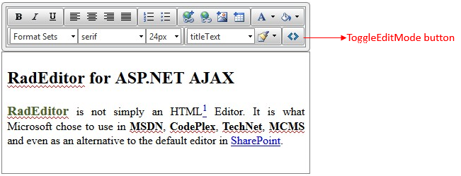

# Inline Editing Mode

This article showcases the **Inline Editing** functionality of the	**Telerik ASP.NET AJAX Editor** that is available as of	**Q3 2014**. You can see it in action in the [Inline Editing](http://demos.telerik.com/aspnet-ajax/editor/examples/inlineediting/defaultcs.aspx)	live demo.

This article contains the following sections:

* [What is Inline Editing](#what-is-inline-editing)—the key features and specifics of the inline editing mode.
* [Enabling RadEditor Inline Editing](#enabling-radeditor-inline-editing)—the basic steps to start using the inline editing together with an example.
* [Customizing the Toolbar](#customizing-the-toolbar)—how to customize the editor toolbar by setting its dimensions and choosing tools.

## What is Inline Editing

Inline Editing feature enables you to directly edit the web page content by using **RadEditor** and at the same time to have an overview of the real layout and appearance.

Here are the key features of the **Inline Editing** mode:

* **Click** on the content to **start editing**. At this point the editor toolbar appears above the content. It uses fade animation by default (see **Example 2**).

* The default toolbar contains only the most commonly used tools (**Figure 1**).

* While not editing, the borders, [modules]() and the default buttons for switching between the different [edit modes]() are hidden.

* You can switch to HTML edit mode via the **ToggleEditMode** button (**Figure 1**).

* The height of the editor is based on the content height via its [AutoResizeHeight feature]() that is enabled by default and cannot be disabled.

* You can set the **Width** property of the control so it matches your current design and layout.

* The [ContentAreaMode]() of the editor is set to **Div**. Thus, the content area becomes part of the current page and the existing style sheets are automatically inherited.

* You can execute custom client-side code when finished with the inline-editing (i.e., clicking outside of the editor's content area) by handling the [OnClientInlineEditCompleted]() event.

>caption Figure 1: RadEditor with Inline Editing enabled



## Enabling RadEditor Inline Editing

The inline editing functionality is controlled by the **EditType** property of **RadEditor**. To enable it:

1. Set the **EditType** property to **Inline**.

1. Wrap your already existing layout into the **Content** tag of **RadEditor** (see **Example 1**).

1. Optionally, set the **Width** property of the editor so it fits your layout.

>caption Example 1: Enabling RadEditor inline editing:

````ASP.NET
<telerik:RadEditor ID="RadEditor1" runat="server" EditType="Inline">
	<Content>
		<div style="width: 420px">
			<h2 class="titleText">RadEditor for ASP.NET AJAX</h2>
			<p style="text-align: justify;">
				<span style="color: #4f6128; font-size: 19px;"><strong>RadEditor</strong></span><span style="color: #4f6128;">
				</span>is not simply an HTML
				<a href="#HTMLDescription">
					<sup>1</sup>
				</a> Editor. It is what Microsoft chose to use in <strong>MSDN</strong>, <strong>CodePlex</strong>, <strong>TechNet</strong>, <strong>MCMS</strong> and even as an alternative to the default editor in
				<a href="http://www.telerik.com/products/aspnet-ajax/sharepoint.aspx">SharePoint</a>.
			</p>
		</div>
	</Content>
</telerik:RadEditor>
````


The result of this example is displayed in **Figure 1**.

## Customizing the Toolbar

The toolbar width has a default value that accommodates the default toolbar. If you set the **Width** property of the editor, however, the toolbar will also inherit this value. If you need to set different width only for the toolbar, you can use the **ToolsWidth** property.

You can see how to add/remove tools in the toolbar in the following help articles:

* [Configure the toolbar using an XML ToolsFile]()
* [Adding Standard Buttons]()
* [Adding Your Own Buttons]()

By default, the toolbar shows with a fade-in animation when the editor is in inline edit mode. You can use the **AnimationSettings** inner tag of the control to disable the animation or to change its duration via the **Type** and **Duration** properties of the **ToolbarAnimations** section:

>caption Example 2: Changing the animation settings of RadEditor in Inline edit mode on the server

````ASP.NET
<telerik:RadEditor ID="RadEditor1" runat="server" EditType="Inline">
	<AnimationSettings>
		<ToolbarAnimation Type="Fade" Duration="1000" />
	</AnimationSettings>
</telerik:RadEditor>
````


You can also change the animation on the client:

>caption Example 3: Changing the animation settings of RadEditor in Inline edit mode on the client

````JavaScript
function changeAnimationSettings() {
	var editor = $find("<%=RadEditor1.ClientID%>");
	var toolAdapter = editor.get_toolAdapter();
	toolAdapter.set_animationType(Telerik.Web.UI.Editor.EditorToolBarAnimationType.None); //or Telerik.Web.UI.Editor.EditorToolBarAnimationType.Fade which is the default value
	toolAdapter.set_animationDuration(500);
}
````


## See Also

 * [ContentAreaMode Property]()

 * [Edit Modes]()

 * [Overview]()

 * [Using ToolsFile.xml]()

 * [Add Standard Buttons]()

 * [Add Your Own Buttons]()

 * [Automatic Height Resize]()

 * [OnClientInlineEditCompleted]()

 * [Live demo: Editor - Inline Editing](http://demos.telerik.com/aspnet-ajax/editor/examples/inlineediting/defaultcs.aspx)
