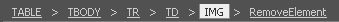

# Modules Overview

The System Modules represent special tools, which can be displayed like Toolbars. However, the Modules do not accommodate buttons, but rather have a pre-defined purpose. The RadEditor modules currently shipped out-of-the-box are:


## Statistics Module

This module displays general test statistics: the number of words and number of characters (including spaces).


>note Please note that you have to click with the mouse inside the content area for the statistics module to update, i.e. it will not update on every keystroke for the purposes of performance optimization.
>
>By design, the RadEditorStatistics module does not count the following characters: ! . ? ; , : & _ - – { } [ ] ( ) ~ # ' "

You can fine-tune the results in the Statistics module by overriding its counter mechanism as it is shown in the following example:

>caption Example 1: Override counter mechanism of Statistics module.

````ASP.NET
<telerik:RadEditor RenderMode="Lightweight" ID="RadEditor1" runat="server">
</telerik:RadEditor>

<script>
    Telerik.Web.UI.Editor.Modules.RadEditorStatistics.prototype.doCount = function () {
        var that = this;
        if (!that.get_visible()) return;

        // You can, for example, pass false value to not remove the white spaces in the counter
        var text = that.get_editor().get_text({ removeMultipleSpaces: true }); 
        text = text.replace(that._trimNewLineCharsRegExp, "");

        var wordsCount = that._getWordsCount(text);
        var charsCount = that._getCharactersCount(text);

        that._renderCounts(wordsCount, charsCount);
    };
</script>
````

## Dom / Tag Inspector

This module displays the DOM path of the current tag. It allows you to easily select a given tag in the hierarchy and remove it using the "Remove Element" button:



In the content area, each element is highlighted as the mouse passes over the tag. The screenshot below shows the mouse passing over an unordered list "<UL>" and the corresponding bullet points in the content area area highlighted.


## Node Inspector

This powerful module displays relevant properties of the currently selected tag. As a result, the user can quickly configure the element (e.g. set cell width, shading, image alignment, etc.) without the need to open dialogs. To conserve space only important and frequently used properties are displayed.


## HTML Inspector

This module displays a pane with the HTML code of the content. The HTML is updated and kept in real-time sync with the WYSIWYG content pane. The effect is similar to the Split mode of MS FrontPage. If you make a modification in the WYSIWYG pane or the HTML pane, the other pane will be automatically updated. This module is a great fine-tuning tool for advanced users:


# See Also

 * [Built-in Modules](http://demos.telerik.com/aspnet-ajax/editor/examples/builtinmodules/defaultcs.aspx)

 * [Custom Modules](http://demos.telerik.com/aspnet-ajax/editor/examples/custommodules/defaultcs.aspx)
