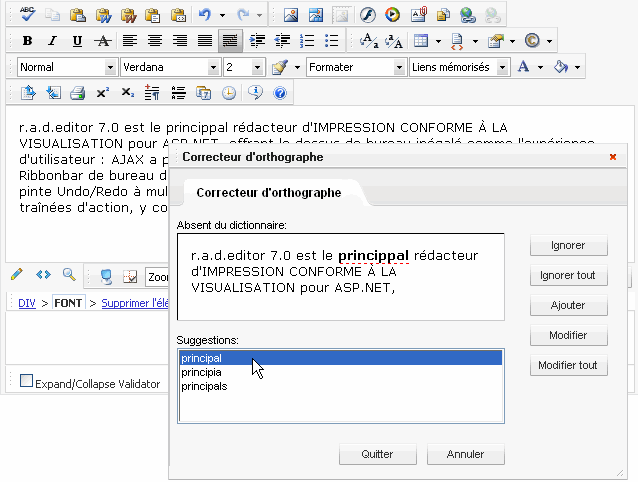
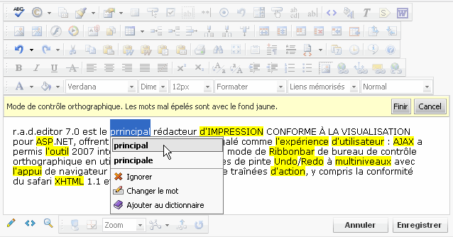

# Localization

Similarly to the Telerik RadEditor, the spellchecking component Telerik RadSpell can be easily localized. This means that you can translate all labels, tooltips, and error messages, by switching the RadEditor [Language](http://www.telerik.com/help/aspnet-ajax/p_telerik_web_ui_radspell_language.html) property to the new localization.

**Localizing the SpellChecker dialog (<tool name="SpellCheck"/>):**

The best way to create a new language is to duplicate the en-US localization folder of Telerik RadSpell (RadControls/Spell/en-US) and localize the files in it.

````XML
<pre xmlns="http://ddue.schemas.microsoft.com/authoring/2003/5"><?xml version="1.0" encoding="ISO-8859-1"?>
	<localization>
	 <string id="Title">Correcteur d'orthographe</string>
	 <string id="NoPermission">Vous n'avez pas les autorisations pour acceder a cette page ou votre session est expiree<br />Actualisez la page.</string>
	 <string id="Tab1HeaderText">Correcteur d'orthographe</string>
	 <string id="ProgressMessage">Correction d'orthographe en cours.....</string>
	 <string id="Confirm">Desirez-vous appliquer ou annuler les corrections faites jusqu'a maintenant?</string>
	 <string id="ChangesMade">Vous avez apporte des changements au texte</string>
	 <string id="SpellCheckComplete">La correction d'orthographe est terminee.</string>
	 <string id="Nosuggestions">Aucune suggestion</string>
	 <string id="Undo">Annuler</string>
	 <string id="UndoEdit">Annuler la modification</string>
	 <string id="Ignore">Ignorer</string>
	 <string id="IgnoreAll">Ignorer tout</string>
	 <string id="Cancel">Quitter</string>
	 <string id="AddCustom">Ajouter</string>
	 <string id="Change">Modifier</string>
	 <string id="ChangeAll">Modifier tout</string>
	 <string id="Help">Aide</string>
	 <string id="NotInDictionary">Absent du dictionnaire:</string>
	 <string id="Suggestions">Suggestions:</string>
	 <string id="AddWord1">Etes-vous certain de vouloir ajouter '</string>
	 <string id="AddWord2">' au dictionnaire personnalise?</string>
	</localization>
</pre>     
````


At the end you need to use set the **Language** property of Telerik RadEditor to apply the new language:

````ASP.NET
<pre xmlns="http://ddue.schemas.microsoft.com/authoring/2003/5">
	<telerik:RadEditor Id="RadEditor1" Language="fr-FR" Runat="server">
	</telerik:RadEditor>
</pre>          
````

Here is how the spellchecker dialog will look with the French localization:



Localizing the AjaxSpellChecker (<tool name="SpellCheck"/>):

````XML
<pre xmlns="http://ddue.schemas.microsoft.com/authoring/2003/5">
	<string id="SpellCheckEnd">Finir</string>
	<string id="SpellCheckComplete">Verificateur d'orthographe a fini</string>
	<string id="SpellingChange">Remplacer le terme</string>
	<string id="NoSuggestions">(pas de suggestion)</string>
	<string id="ChangeWordString">Changer le mot</string>
	<string id="IgnoreAllString">Tout ignorer</string>
	<string id="IgnoreString">Ignorer</string>
	<string id="MoreThanOnceMessage">Ce mot apparait plus d’une fois dans le texte. Voulez-vous remplacer tous les termes?</string>
	<string id="AddToDictionary">Ajouter au dictionnaire</string>
	<string id="AddCustomWordSuccess">avec succes supplementaire au dictionnaire</string>
	<string id="SpellingInProgress">Controle orthographique en marche...</string>
	<string id="SpellingMode">Mode de controle orthographique. Les mots mal epeles sont avec le fond jaune.</string>
	<string id="NoSpellingMistakes">Erreur n'a pas trouve.</string>
</pre>	          
````




If you want to localize Telerik RadSpell in Hebrew, just copy and rename the "en-US" folder as "he-IL" (The culture name has to follow the RFC 1766 standard in the format [Language Code]-[County/Region Code]. In our example he-IL stands for Hebrew - Israel ). Then you'll have to localize the "SpellCheck.xml" file in the "./RadControls/Spell/Localization/he-IL" folder.
