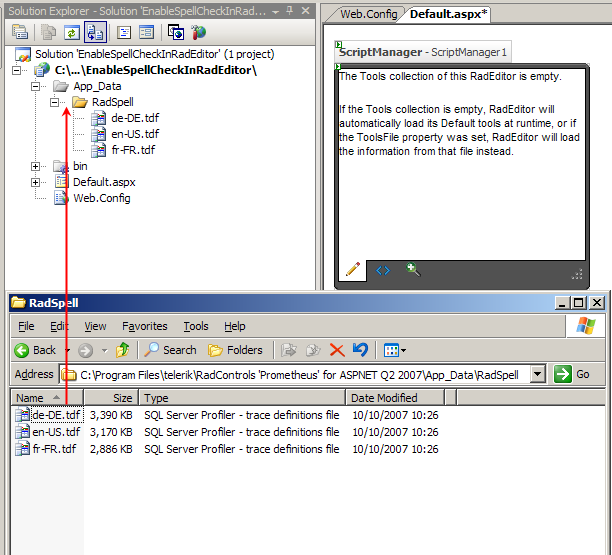

# Spellchecker Overview


## 

To enable spell checking in your web application you need to accomplish the following 2 tasks:

1. Copy the needed dictionary files in your project's App_Data folder:The files are located in your __<Controls installation folder>\App_Data\RadSpell__. Create a __RadSpell__ folder in your project's __App_Data__ folder and copy the dictionaries there
>caption 



1. Add the SpellCheck handler in your __web.config__ file. This can be done by using one of the following approaches:

1. Manually add the handler in your __web.config__ file (in the __httpHandlers__ section):

````XML
	    <add verb="*" validate="false" path="Telerik.Web.UI.SpellCheckHandler.axd" type="Telerik.Web.UI.SpellCheckHandler, Telerik.Web.UI" />
````


1. Use the RadEditor's Smart Tag in Visual Studio. Note that the smart tag will appear only if you have the __Telerik.Web.UI.dll__ file in your project's __bin__ folder or in the GAC:
>caption 


1. Set the Language property of the RadEditor (by default it is set to "en-US"). If you want to change the language, you can do this by

1. declaring the property in the RadEditor's declaration:

````ASPNET
	    <telerik:RadEditor runat="server" ID="RadEditor1">
	        <Languages>
	            <telerik:SpellCheckerLanguage Code="fr-FR" Title="French" />
	        </Languages>
	    </telerik:RadEditor>
````


1. adding the language in the RadEditor's Languages collection. It is recommended to add the language in Page_Load


````C#
	
	        if (!Page.IsPostBack)
	        {
	            RadEditor1.Languages.Add(new SpellCheckerLanguage("fr-FR", "French"));
	        }
				
````
````VB
	    Protected Sub Page_Load(ByVal sender As Object, ByVal e As EventArgs)
	        If Not Page.IsPostBack Then
	            RadEditor1.Languages.Add(New SpellCheckerLanguage("fr-FR", "French"))
	        End If
	    End Sub
````

