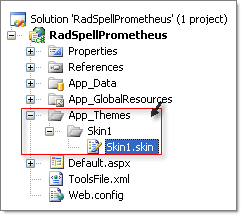

# Add Standard Buttons

RadEditor provides 4 different ways to configure toolbars:

## Setting Tools in the RadEditor declaration

````ASP.NET
<telerik:RadEditor runat="server" ID="RadEditor1" Height="100px">
	<Tools>
		<telerik:EditorToolGroup>
			<telerik:EditorTool Name="Cut" />
			<telerik:EditorTool Name="Copy" />
			<telerik:EditorTool Name="Paste" />
		</telerik:EditorToolGroup>
	</Tools>
</telerik:RadEditor>
````

A useful design-time feature of the **Name** attribute is that it offers a list with the names of all available RadEditor tools. Press Ctrl-Space to display the drop down list.


>note Please, note that the selected ToolsFile or the built-in default tools file will not be loaded if you set the Tools collection in the control tag.

## Setting the tools via the ToolsFile property

As in earlier versions of RadEditor, you can configure the toolbar using a ToolsFile.xml file:

````ASP.NET
<telerik:RadEditor ToolsFile="~/ToolsFile.xml" runat="server" ID="RadEditor1">
</telerik:RadEditor>
````


````XML
<root>  
	<tools name="MainToolbar" enabled="true">    
		<tool name="AjaxSpellCheck" />    
		<tool name="InsertSymbol" />    
		<tool name="FormatCodeBlock" />  
	</tools>
</root>
````


## Setting Tools Programmatically in the Code-Behind

````C#
EditorToolGroup main = new EditorToolGroup();
RadEditor3.Tools.Add(main);
EditorTool bold= new EditorTool();
bold.Name = "Bold";
bold.ShortCut = "CTRL+B";
main.Tools.Add(bold);
EditorTool italic = new EditorTool();
italic.Name = "Italic";
italic.ShortCut = "CTRL+I";
main.Tools.Add(italic);
EditorTool underline = new EditorTool();
underline.Name = "Underline";underline.ShortCut = "CTRL+U";
main.Tools.Add(underline);	
````
````VB
RadEditor1.Tools.Clear()
Dim main As New EditorToolGroup()
RadEditor1.Tools.Add(main)
Dim bold As New EditorTool()
bold.Name = "Bold"
bold.ShortCut = "CTRL+B"
main.Tools.Add(bold)
Dim italic As New EditorTool()
italic.Name = "Italic"
italic.ShortCut = "CTRL+I"
main.Tools.Add(italic)
Dim underline As New EditorTool()
underline.Name = "Underline"
underline.ShortCut = "CTRL+U"
main.Tools.Add(underline)
````

You can also use the following syntax to add a standard button to the toolbar. The example below adds a "Bold" button to the end of the first group of tools.

````C#
EditorTool tool = new EditorTool("Bold"); 
tool.Type = EditorToolType.Button; 
RadEditor1.Tools[0].Tools.Add(tool);
````
````VB
Dim tool As New EditorTool("Bold")
tool.Type = EditorToolType.Button
RadEditor1.Tools(0).Tools.Add(tool)
````


>note Please, note that if a new EditorToolGroup is added then the Tools collection will be reset. You can download the default ToolsFile.xml file of RadEditor from [here](http://www.telerik.com/support/kb/aspnet-ajax/editor/default-toolsfile-xml-file.aspx).


## Setting the tools by using Themes

You can use a theme to conveniently set the tools for a number of RadSpell instances that use the theme. In this example the skin file is part of a **Theme** named "Skin1".



In your .skin file declare RadEditor with the tools that will be displayed in the RadEditor instances that use this theme.Set the **SkinId**property for the RadEditor. This will be referenced later in the RadEditor that uses the theme. In this example skin file the **SkinId** is "SomeTools".

````XML
<%@ register tagprefix="telerik" namespace="Telerik.Web.UI" assembly="Telerik.Web.UI" %>
<telerik:RadEditor ID="Radeditor1" runat="server" SkinID="SomeTools">
	<Tools>
		<telerik:EditorToolGroup>
			<telerik:EditorTool Name="Bold" />
			<telerik:EditorTool Name="Italic" />
		</telerik:EditorToolGroup>
	</Tools>
</telerik:RadEditor>
````

Once the skin is set, you need to declare the RadEditor and specify the **SkinId** property. You also need to set the Page **Theme** attribute. In the example below the **Theme** is named "Skin1" and the **SkinId** is "SomeTools".

````ASP.NET
<%@ page language="C#" autoeventwireup="true" codebehind="Default.aspx.cs" inherits="RadSpell._Default"
	theme="Skin1" %>

...
<telerik:RadEditor SkinID="SomeTools" Height="100px" runat="server" ID="RadEditor1">
</telerik:RadEditor>
````

Note: More information on how to use ASP.NET 2.x Themes is available in [MSDN](http://msdn2.microsoft.com/en-us/library/wcyt4fxb(vs.80).aspx).

## See Also

 * [Overview]()
