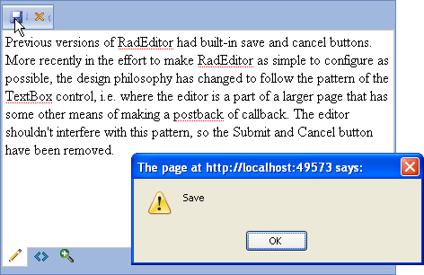

# Save and Cancel Buttons

>note Previous versions of RadEditor had built-in save and cancel buttons. More recently in the effort to make RadEditor as simple to configure as possible, the design philosophy has changed to follow the pattern of the TextBox control, i.e. where the editor is a part of a larger page that has some other means of making a postback or callback. The editor shouldn't interfere with this pattern, so the built-in Submit and Cancel button have been removed.

You can implement custom save and cancel buttons using **RadEditor**, a **RadAjaxManager** AjaxRequest, and two predefined "Save" and "Cancel" tools that are automatically styled according to the current skin.The example below is a stub implementation that configures the two button tools, implements save and cancel commands on the client and calls back to the server where save and cancel logic is carried out. In this example the server logic simply displays an alert dialog with the operation that should be carried out.



>note You can extend the logic shown in this example to save into a database or other storage medium. See [Save in a File]() or [Save in a Database]() for more information.

Create a ToolsFile.xml with a structure similar to the following:

````XML
<root>  
	<tools name="MainToolbar">    
		<tool name="Save" />    
		<tool name="Cancel" />  
	</tools>
</root>
````

>important If you are using **Lightweight** rendering mode the Save and Cancel button will be not styled with the default icons. You will need to decorate them additionally by using these CSS rules:
>
>        .reTool.reSave:before{
>            content:"\e109";
>        }
>
>        .reTool.reCancel:before {
>            content:"\e115";
>        }


Configure the RadAjaxManager and RadEditor controls similar to the example markup below. RadAjaxManager will have a OnAjaxRequest handler to execute save and cancel logic on the server. RadEditor will consume the ToolsFile.xml created in the previous step. Just below the RadEditor declaration is the implementation of the "Save" and "Cancel" commands. Both implementations call an JavaScript function "ajaxRequest()" and pass a string argument "Save" or "Cancel". ajaxRequest() will be defined in a following step.

````ASP.NET
<telerik:RadAjaxManager ID="RadAjaxManager1" runat="server" OnAjaxRequest="RadAjaxManager1_AjaxRequest">
</telerik:RadAjaxManager>
<telerik:RadEditor RenderMode="Lightweight" ID="RadEditor1" runat="server" Skin="Web20" ToolsFile="ToolsFile.xml">
</telerik:RadEditor>
<script type="text/javascript">
	Telerik.Web.UI.Editor.CommandList["Save"] = function (commandName, editor, oTool)
	{
		ajaxRequest("Save"); 
	}

	Telerik.Web.UI.Editor.CommandList["Cancel"] = function (commandName, editor, oTool)
	{
		ajaxRequest("Cancel");
	}
</script>
````

Add a RadScriptBlock and JavaScript function "ajaxRequest()" (you can add this block of code to the <head> tag). In this function you retrieve the client side RadAjaxManager object and call the client AjaxRequest() method, passing the current operation (i.e. "Save" or "Cancel").

````ASP.NET
<telerik:RadScriptBlock ID="RadScriptBlock1" runat="server">
	<script type="text/javascript">    
		function ajaxRequest(operation)    
		{       
			var ajaxManager = $find("<%= RadAjaxManager1.ClientID %>");       
			ajaxManager.ajaxRequest(operation);    
		}    
	</script>
</telerik:RadScriptBlock>
````

````C#
protected void RadAjaxManager1_AjaxRequest(object sender, Telerik.Web.UI.AjaxRequestEventArgs e)
{    
	if (e.Argument == "Save")    
	{        
		RadAjaxManager1.Alert("Save");     
	}    
	else    
	{        
		RadAjaxManager1.Alert("Cancel");     
	}
}			
````
````VB
Protected Sub RadAjaxManager1_AjaxRequest(ByVal sender As Object, ByVal e As Telerik.Web.UI.AjaxRequestEventArgs)

	If e.Argument = "Save" Then
		RadAjaxManager1.Alert("Save")
	Else
		RadAjaxManager1.Alert("Cancel")
	End If

End Sub	
````

