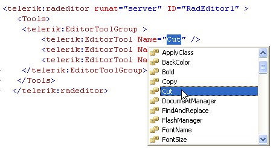

# Remove Toolbar Buttons


## 

You can either remove toolbar buttons programmatically or using the ToolsFile.xml file:

**Programmatically:**

The second way to remove toolbar buttons is by using the provided RadEditor's Server-Side API and the Remove method of the Tools collection. You can hide the desired button with the following RemoveButton function:


````C#
	
	    protected void Page_Load(object sender, EventArgs e)
	    {
	        if (!IsPostBack)
	        {
	            RadEditor1.EnsureToolsFileLoaded();
	            RemoveButton("FindAndReplace");
	            RemoveButton("Cut");
	            RemoveButton("Copy");
	            RemoveButton("Paste");
	        }
	    }
	    public void RemoveButton(string name)
	    {
	        foreach (Telerik.Web.UI.EditorToolGroup group in RadEditor1.Tools)
	        {
	            EditorTool tool = group.FindTool(name);
	            if (tool != null)
	            {
	                group.Tools.Remove(tool);
	            }
	        }
	    } 
				
````
````VB
	    Protected Sub Page_Load(ByVal sender As Object, ByVal e As EventArgs)
	        If Not IsPostBack Then
	            EnsureToolsFileLoaded()
	            RemoveButton("FindAndReplace")
	            RemoveButton("Cut")
	            RemoveButton("Copy")
	            RemoveButton("Paste")
	        End If
	    End Sub
	    Public Sub RemoveButton(ByVal name As String)
	        For Each group As Telerik.Web.UI.EditorToolGroup In RadEditor1.Tools
	            Dim tool As EditorTool = group.FindTool(name)
	            If tool <> Nothing Then
	                group.Tools.Remove(tool)
	            End If
	        Next
	    End Sub
````


You can see list the available tools in RadEditor by using the autocomplete feature of the Name EditorTool innertag attribute (to show the dropdown use Ctrl+Space):
>caption 



**Using the ToolsFile.xml:**

To remove a toolbar button from a toolbar, just open the ToolsFile.xml and delete its tag. For example, to remove the Cut, Copy and Paste buttons delete the respective **tool** tags below and save the ToolsFile.xml after that:

````XML
	
	<root>
	   <tools name="MainToolbar" dockable="true" dockingZone="Top" enabled="true">
	      <tool name="Cut" />  
	      <tool name="Copy" />
	      <tool name="Paste" />
	      <tool name="PasteFromWord" />
	      <tool name="PastePlainText" />
	      <tool name="PasteAsHtml"  />
	   </tools>
	<root>
	            
````


