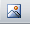
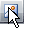
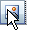
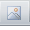

# Set Button State


## 

RadEditor toolbar buttons have four states:
>caption 



**Active**
>caption 



**Highlighted**
>caption 



**Pressed**
>caption 



**Disabled**

The highlighted state is controlled by a CSS class of RadEditor. The active, pressed and disabled button states can be controlled programmatically on the client. Here is an example that demonstrates how to implement an adaptive custom button that will be highlighted when an image in the content area is selected. The custom button will be highlighted only when the image is selected in the content area:

````ASPNET
	<script type="text/javascript">
		function OnClientSelectionChange(editor, args) {
			var selElem = editor.getSelection().getParentElement(); //return the currently selected object in the content area
			var oTool = editor.getToolByName("Custom1"); //get a reference to the custom tool
			if (selElem.tagName == "IMG") //if the selected element is of image type, make the tool's icon active
			{
				oTool.setState(0); //Enable Tool Icon
			}
			else {
				oTool.setState(-1); //Disable Tool Icon
			}
		}
	</script>
	<telerik:radeditor runat="server" ID="RadEditor1" OnClientSelectionChange="OnClientSelectionChange">
	   <Tools>
	       <telerik:EditorToolGroup>
	           <telerik:EditorTool Name="Custom1" />
	       </telerik:EditorToolGroup>
	   </Tools>
	   <Content>
	    </img>
	   </Content>
	</telerik:radeditor> 
````


To put the custom button in pressed state use oTool.setState(**1**);

To set an icon to the custom button use the following css syntax:

````XML
	<style type="text/css">
	.reToolbar.<skinName> .<commandName>
	{
	 background-image: url(MyImage.gif);
	}
	.reToolbar.Default .Custom1
	{
	 background-image: url(http://www.telerik.com/DEMOS/ASPNET/RadControls/Editor/Skins/Default/buttons/CustomDialog.gif);
	}
	</style>   
````


