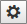
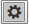
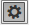
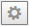

# Set Button State

RadEditor toolbar buttons have four states:

**Enabled** / **Active** (), **Hovered** / **Highlighted** (), **Selected** / **Pressed** (), **Disabled** / **Inactive** ()

All the states of the toolbar buttons can be controlled by CSS ([Set Icons for Toolbar Button States](#set-icons-for-toolbar-button-states)). The enabled, selected and disabled button states can also be set on the client-side. **Example 1** demonstrates how to implement an adaptive custom button that will be enabled when an image in the content area is selected and disabled in all other cases.

>caption **Example 1**: Enable/disable a toolbar button in the editor based on an image selection.

````JavaScript
<script type="text/javascript">
	function OnClientSelectionChange(editor, args) {
		var selElem = editor.getSelection().getParentElement(); //return the currently selected object in the content area
		var oTool = editor.getToolByName("Custom1"); //get a reference to the custom tool
		if (selElem.tagName == "IMG") //if the selected element is of image type, make the tool's icon active
		{
			oTool.setState(0); //Enable Tool Icon
		}
		else {
			oTool.setState(-1); //Disable Tool Icon
		}
	}
</script>
````

````ASP.NET
<telerik:RadEditor runat="server" ID="RadEditor1" OnClientSelectionChange="OnClientSelectionChange">
	<Tools>
		<telerik:EditorToolGroup>
			<telerik:EditorTool Name="Custom1" />
		</telerik:EditorToolGroup>
	</Tools>
	<Content>
		</img>
	</Content>
</telerik:RadEditor>
````

To put the custom button in pressed state use oTool.setState(**1**);

## Set Icons for Toolbar Button States

To set an icon for different states of the custom button use CSS selectors for the corresponding [render mode]().

>caption **Example 2**: CSS override for active, hovered and selected states of a custom toolbar button in RadEditor with RenderMode="Classic".

````CSS
<style type="text/css">

/*Active state*/
.reToolbar.<skinName> .<commandName> {
	background-image: url(MyActiveStateImage.gif);
}
	/*Hovered state*/
	.reToolbar.<skinName> .<commandName>:hover {
		background-image: url(MyHoveredStateImage.gif);
	}
/*Selected state*/
.reToolbar.<skinName> .reTool_selected .<commandName> {
	background-image: url(MySelectedStateImage.gif);
}


/*Active state*/
.reToolbar.Default .Custom1 {
	background-image: url('http://demos.telerik.com/aspnet-ajax/editor/examples/customdialogs/Custom.gif');
}
	/*Hovered state*/
	.reToolbar.Default .Custom1:hover {
		background-image: url('http://demos.telerik.com/aspnet-ajax/editor/examples/customdialogs/CustomDialog.gif');
	}
/*Selected state*/
.reToolbar.Default .reTool_selected .Custom1 {
	background-image: url('http://demos.telerik.com/aspnet-ajax/editor/examples/customdialogs/Print.gif');
}
</style>   
````

>caption **Example 3**: CSS override for active, hovered and selected states of a custom toolbar button in RadEditor with RenderMode="Lightweight".

````CSS
/*Active state*/
.reToolBar.RadEditor_<skinName> .re<commandName>:before {
	content: "\e681";
}
/*Hovered state*/
.reToolBar.RadEditor_<skinName> .re<commandName>:hover:before {
	content: "\e64d";
}
/*Selected state*/
.reToolBar.RadEditor_<skinName> .re<commandName>.reToolSelected:before {
	content: "\e600";
}

/*Active state*/
.reToolBar.RadEditor_Default .reCustom1:before {
	content: "\e681";
}
/*Hovered state*/
.reToolBar.RadEditor_Default .reCustom1:hover:before {
	content: "\e64d";
}
/*Selected state*/
.reToolBar.RadEditor_Default .reCustom1.reToolSelected:before {
	content: "\e600";
}
````

>caption **Example 4**: CSS override for active, hovered and selected states of a custom toolbar button in RadEditor with RenderMode="Mobile".

````CSS
/*Active state*/
.RadEditor_<skinName> .reToolList .reIcon<commandName>:before {
	content: "\e681";
}
/*Hovered state*/
.RadEditor_<skinName> .reToolList .reIcon<commandName>:hover:before {
	content: "\e64d";
}
/*Selected state*/
.RadEditor_<skinName> .reToolList .reButtonSelected .reIcon<commandName>:before {
	content: "\e600";
}

/*Active state*/
.RadEditor_Default .reToolList .reIconCustom1:before {
	content: "\e681";
}
/*Hovered state*/
.RadEditor_Default .reToolList .reIconCustom1:hover:before {
	content: "\e64d";
}
/*Selected state*/
.RadEditor_Default .reToolList .reButtonSelected .reIconCustom1:before {
	content: "\e600";
}
````

## See Also

 * [RadEditor Render Modes]()

