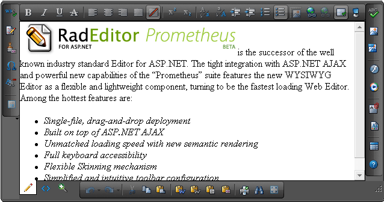

# Docking Zones

The RadEditor Toolbar position can be changed by using the **DockingZone** attribute which can have the following values:

* **Left**

* **Right**

* **Top**

* **Bottom**

* **Module**

* The **id** of an external html element

>caption A RadEditor whose toolbars are positioned in the four built-in zones



If an **external element** is used, it must have the following **CSS classes** applied: **`RadEditor`**, **`reCustomContainer`** (as of Q2 2015), **`<RadEditor Skin>`**. Here is an example with the Default skin: 

````HTML
<div id="outerdiv" class="RadEditor reCustomContainer Default">
</div>
````

You can obtain the skin name dynamically from the RadEditor object through its `get_skin()` JavaScript method, as shown in the [Editor - Docking Zones online demo](http://demos.telerik.com/aspnet-ajax/editor/examples/dockingzone/defaultcs.aspx). 

Here are a few examples of setting a custom toolbar position:

* In the RadEditor declaration:

	**ASP.NET**

		<telerik:RadEditor RenderMode="Lightweight" ID="RadEditor1" runat="server">
		    <Tools>
		        <telerik:EditorToolGroup DockingZone="Left">
		            <telerik:EditorTool Name="AjaxSpellCheck" />
		            . . . .
		        </telerik:EditorToolGroup>
		    </Tools>
		</telerik:RadEditor>

* In the ToolsFile:

	**XML**

		<tools enabled="true" DockingZone="Bottom">
		    <tool name="Bold" />
		    . . . .
		</tools>

* In the code behind:

	**C#**

		EditorToolGroup toolgroupLeft = new EditorToolGroup(); 
		toolgroupLeft.Attributes["DockingZone"] = "Left"; 
		editor.Tools.Add(toolgroupLeft); 
		toolgroupLeft.Tools.Add(new EditorTool("Bold"));

	**VB**

		Dim toolgroupLeft As New EditorToolGroup()
		toolgroupLeft.Attributes("DockingZone") = "Left"
		editor.Tools.Add(toolgroupLeft)
		toolgroupLeft.Tools.Add(New EditorTool("Bold"))


>note When enabling only one [Edit Mode]() (e.g., `EditModes="Design"`) the bottom docking zone will not render. 

## See Also

* [Live demo: Editor - Docking Zones](http://demos.telerik.com/aspnet-ajax/editor/examples/dockingzone/defaultcs.aspx)


