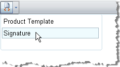
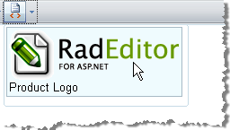
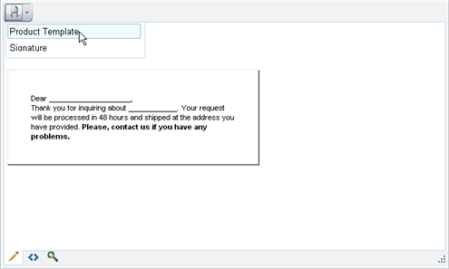

# Code Snippets


The Code snippets dropdown is a convenient tool for inserting predefined chunks of content (HTML) like signatures, product description templates, custom tables, etc. These chunks of content are kept in the __Snippets__collection. You can add to the Snippets____collection declaratively, programmatically and using the ToolsFile.
>caption 



## Using the Snippets Collection Declaratively

````ASPNET
	    <telerik:RadEditor runat="server" ID="RadEditor1">
	        <Snippets>
	            <telerik:EditorSnippet Name="Product Template">            
	                <!-- my table HTML snippet -->            
	                <table>               
	                    <tr>                 
	                        <td>                 
	                                            
	                        </td>               
	                    </tr>            
	                </table>        
	            </telerik:EditorSnippet>
	        </Snippets>
	    </telerik:RadEditor>
````


## Using Snippets Programmatically

Use the __Snippets__collection __Add()__method to include new items in the list.In the following example, we construct a new set of code snippets with two items - a Product Template and an e-mail Signature:

>tabbedCode

````C#
	
	            RadEditor1.Snippets.Add("Product Template", "<table> <tr> <td> </td></tr></table>");
	            RadEditor1.Snippets.Add("Signature", "<strong>John Smith</strong><br>Sales Manager<br>");      
	          
````
````VB
	
	        RadEditor1.Snippets.Add("Product Template", "<table> <tr> <td> </td></tr></table>")
	        RadEditor1.Snippets.Add("Signature", "<strong>John Smith</strong><br>Sales Manager<br>")
	
````
>end

To create a dropdown with image thumbnails, insert the img tag as the first argument of the __Add()__ method. The img tag content is the path to the image source:
>caption 



>tabbedCode

````C#
	
	            RadEditor1.Snippets.Add(" test", "test");
	          
````
````VB
	
	        RadEditor1.Snippets.Add(" test", "test")
	
````
>end

## Using the ToolsFile

You can also populate the Custom links dropdown using the ToolsFile.xml file. For the HTML code to be interpreted correctly in the XML file, enclose the code in __<![CDATA[ //]]>__ as shown in the example below:
>caption 



````XML
	    <snippets>   
	        <snippet name="Product Template">      
	            <![CDATA[         
	                <div style="width:300px;border:2px outset #D8D2BD;padding:34px;font-family:Arial, Verdana; font-size:11px;background- color:#F1EFE6;">
	                    Dear ____________________,<br>
	                    Thank you for inquiring about ____________. Your request will be processed in 48 hours and shipped at the address you have provided.
	                    <b>Please, contact us if you have any problems.</b>
	                </div>
	            //]]>  
	        </snippet>   
	        <snippet name="Signature">      
	            <![CDATA[         
	                <strong>John Smith</strong>
	                <br>Sales Manager<br>         
	                ...         
	                ************************************************      
	             //]]>  
	            </snippet>
	        </snippets>
````


To set an image icon in an "Insert Code Snippet" item, put an IMG tag either in front of or next to the Title inside the name attribute of the respective snippet tag:<snippet name="&lt;img src='http://www.telerik.com/RadControls/Editor/Skins/Custom/buttons/AjaxSpellCheck.gif' /&gt;Order Confirmation">

You should also encode the < and > tags symbols of the IMG tag with &lt; and &gt;.

>note Bear in mind that RadEditor will persist its state (including the Code Snippets set) between postbacks. In order to create a new set of Code Snippets (e.g. for different users), you will need to clear it first. This can be done using Remove() or Clear() methods from the Snippets collection.
>


# See Also

 * [Set Properties]()
