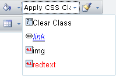

# CSS Styles

In this article you can learn about the usage and configuration of the **Apply Css Class** tool.

The **Apply Css Class** dropdown of **RadEditor** displays all classes defined in the page or from [external CSS files](). The dropdown is populated from the **CssClasses** Collection. You can add items to the **CssClasses** collection declaratively, programmatically and using the ToolsFile.

>caption Figure 1: Apply CSS Class dropdown


## Using the CssClasses Collection Declaratively

>note As of **Q3 2015**, **Apply CSS Class** can apply classes to block elements. To instruct the tool to do so, you should add a CSS rule with a selector of this type—`[tag].[classname]`. For example, `p.red-background`. 

In the **RadEditor** declaration, add **EditorCssClass** elements to **CssClasses**. In the example below all three CSS classes are listed along with a "Clear Class" entry. If the **CssClasses** tag is empty all available classes will be listed.

>important If your page does not contain any css classes and you try set an item in the dropdown with the CssClasses.Add syntax, e.g.
>
>`RadEditor1.CssClasses.Add("Links class ", "a.link")`
>
>then the item will not be populated, because the a.link will not exist on the page. 
>
>In order for a class to appear in the dropdown it should present either on the page's CSS or in a CSS file added in the **CssFiles** collection.

>important Note that if you have CSS classes defined with the following syntax:
>
> `.Emphasis, p em{color: #A4CE3A; font-style: normal; }` 
>
>then the editor will parse and read only the `.Emphasis` class and will populate the **Apply Css Class** dropdown only with this class. If **RadEditor** starts to parse the strings after the comma, this will drastically decrease the editor performance and it will be loaded slower on the page.

>caption Example 1: Configuring Apply CSS Class dropdown.

````ASP.NET    
<style>
	p.red-background {
	    background-color:red;
	}

	a.link
	{  
		 color: #0000ff;   
		 font-weight: normal;   
		 font-style: italic;
	}
	.img   
	{
		border: none;
	}
	.redtext
	{     
		color: red;
	}
</style>

...

<telerik:RadEditor runat="server" ID="RadEditor1" Skin="WebBlue">    
	<CssClasses>        
		<telerik:EditorCssClass Name="Clear Class" Value="" /> 
		<telerik:EditorCssClass Name="Paragraph-Red Background" Value="p.red-background" />        
		<telerik:EditorCssClass Name="link" Value="a.link" />        
		<telerik:EditorCssClass Name="img" Value=".img" />        
		<telerik:EditorCssClass Name="redtext" Value=".redtext" />    
	</CssClasses>
</telerik:RadEditor>		
````

## Using CssClasses Programmatically

Use the **Add()** method to include classes in the CssClasses collection. In the example below, only the a.link and .img styles will be listed in the dropdown:

>caption Example 2: Adding Classes programatically. 

````C#
RadEditor1.CssClasses.Add("Links Class", "a.link");
RadEditor1.CssClasses.Add("Images Class", ".img");
````
````VB
RadEditor1.CssClasses.Add("Links Class", "a.link")
RadEditor1.CssClasses.Add("Images Class", ".img")
````

>caution Make sure you specify the exact name of the class (i.e. " **a.link** " - not "a" or "link"; " **.img** " - not "img").

Using the **Add()** method resets the CssClasses dropdown, so the CssClasses you add will not be appended to the default set, but will rather create a new CssClasses set. If the CssClasses collection is left empty, all available classes will be listed.


|  **Default state**  |  **Programmatic population**  |
| ------ | ------ |
|||
|(The CSS class dropdown containsall existing classes)|(The CSS class dropdown containsonly the classes added usingthe **Add()** method)|

## Using the ToolsFile

You can also populate the CSS class dropdown using the **ToolsFile**, as shown in the example below:

>caption Example 3: Adding Classes via ToolsFile.xml file.

````XML  
<root>  
	<tools name="MainToolbar" enabled="true">    
		<tool name="ApplyClass" />      
	</tools>  
	<classes>    
		<class name="Clear Class" value="" />    
		<class name="Links Class" value="a.link" />    
		<class name="Images Class" value=".img" />    
		<class name="My Red Text" value=".redText" />  
	</classes>
</root>			
````

>note Bear in mind that **RadEditor** will persist its state (including the CSS classes set) between post backs. In order to create a new set of CSS classes (e.g. for different users), you will need to clear it first. This can be done using **Remove()** and **Clear()** methods of **CssClasses** collection.

## See Also

 * [Set Properties]()

 * [External CSS Files]()
