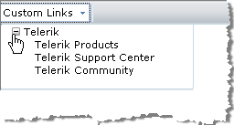
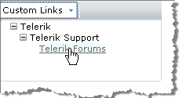

# Custom Links

The RadEditor Custom Links dropdown is a convenient tool for inserting pre-defined hyperlinks. These usually be one of two link types:

* Internal site links (i.e. links to other pages of the web-site). You can preload the Custom Links treeview with the complete structure of your site so that the end-users would just need to select a page from the dropdown (e.g."About-us -> History").

* Frequently used external links (e.g. Google).

Custom links are kept in the **Links** collection. You can add a new custom link to the **Links** collection declaratively, programmatically and using the ToolsFile.



## Using the Links Collection Declaratively

The example below demonstrates how to add a sublist in the Custom Links dropdown treeview. The parent node is the Telerik link and its childs are Telerik Products, Telerik Support Center and Telerik Community:

````ASP.NET
<telerik:radeditor runat="server" ID="RadEditor1">    
	<Links>        
		<telerik:EditorLink Name="Telerik" Href="http://www.telerik.com">            
		<telerik:EditorLink Name="Telerik Products" Href="http://www.telerik.com/products" Target="_blank" />            
		<telerik:EditorLink Name="Telerik Support Center" Href="http://www.telerik.com/support/home.aspx" Target="_blank" />            
		<telerik:EditorLink Name="Telerik Community" Href="http://www.telerik.com/community/home.aspx" Target="_blank" ToolTip="Telerik Community" />        
		</telerik:EditorLink>    
	</Links>
</telerik:radeditor>	
````


## Using Links Programmatically

In the following example, we construct a simple 3-level Custom Links treeview:



````C#
RadEditor1.Links.Clear();
Telerik.Web.UI.EditorLink telerik = new Telerik.Web.UI.EditorLink();
telerik.Name = "Telerik";
telerik.Href = "http://www.telerik.com/products";
telerik.ToolTip = "Telerik";
Telerik.Web.UI.EditorLink support = new Telerik.Web.UI.EditorLink();
support.Name = "Telerik Support";
support.Href = "http://www.telerik.com/support/home.aspx";
support.ToolTip = "Telerik Support Center";
Telerik.Web.UI.EditorLink forums = new Telerik.Web.UI.EditorLink();
forums.Name = "Telerik Forums";
forums.Href = "http://www.telerik.com/forums";
forums.ToolTip = "Telerik Forums";

RadEditor1.Links.Add(telerik); // Adds the telerik link to the Links dropdown
telerik.ChildLinks.Add(support); //Adds the support link as a child of the telerik link
support.ChildLinks.Add(forums); //Adds the forums link as a child of the support link			
````
````VB
RadEditor1.Links.Clear()
Dim telerik As New Telerik.Web.UI.EditorLink()
telerik.Name = "Telerik"
telerik.Href = "http://www.telerik.com/products"
telerik.ToolTip = "Telerik"
Dim support As New Telerik.Web.UI.EditorLink()
support.Name = "Telerik Support"
support.Href = "http://www.telerik.com/support/home.aspx"
support.ToolTip = "Telerik Support Center"
Dim forums As New Telerik.Web.UI.EditorLink()
forums.Name = "Telerik Forums"
forums.Href = "http://www.telerik.com/forums"
forums.ToolTip = "Telerik Forums"

RadEditor1.Links.Add(telerik)
' Adds the telerik link to the Links dropdown
telerik.ChildLinks.Add(support)
'Adds the support link as a child of the telerik link
support.ChildLinks.Add(forums)
'Adds the forums link as a child of the support link
````

## Using the ToolsFile

You can also populate the Custom Links treeview using the ToolsFile.xml file, as shown in the example below:

````XML
<root>
 <tools name="MainToolbar" enabled="true">
   <tool name="InsertCustomLink" />
 </tools>
 <links>
   <link name="Telerik" href="http://www.telerik.com">
	 <link name="Products" href="http://www.telerik.com/products">
	   <link name="Telerik® UI for ASP.NET Ajax suite" href="http://www.telerik.com/radcontrols" />
	   <link name="Telerik RadNavigation suite" href="http://www.telerik.com/radnavigation" />
	   <link name="Telerik RadEditor" href="http://www.telerik.com/radeditor">
		 <link name="QSF" href="http://www.telerik.com/Telerik RadEditor"/>
	   </link>
	 </link>
	 <link name="Purchase" href="http://www.telerik.com/purchase" />
	 <link name="Support" href="http://www.telerik.com/support" />
	 <link name="Client.Net" href="http://www.telerik.com/clientnet" />
   </link>
 </links>
</root> 	
````


>note Please bear in mind that RadEditor will persist its state (including the Custom Links set) between post backs. In order to create a new set of Custom Links (e.g. for different users), you will need to clear it first. This can be done using **Remove()** or **Clear()** methods of the Links collection.

## See Also

 * [Set Properties]()
