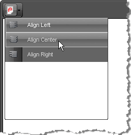

# Custom ToolStrip

ToolStrips are useful dropdowns that contain a group of tools with related functionality and can be a very convenient means of arranging tools used in the editor. An example of a simple ToolStrip with a group of alignment tools is shown below:




Set a custom raster image for the Classic Render Mode

````ASP.NET
<style>
	/* The generic class name is re<toolName> */
	a.reTool .MyToolStrip,
	a.reTool .MyToolStrip:hover
	{
		background-image: url(images/some-image.png);
		background-repeat: no-repeat;
		/* optionally, tweak the position */
		/*background-position: 2px 2px;*/
	}

	/* remove the built-in icon */
	a.reTool .MyToolStrip:before
	{
		content: "";
	}
</style>
...
<telerik:RadEditor RenderMode="Lightweight" runat="server" ID="RadEditor1">
	<Tools>
		<telerik:EditorToolGroup>
			<telerik:EditorToolStrip Name="MyToolStrip">
				<telerik:EditorTool Name="JustifyLeft" />
				<telerik:EditorTool Name="JustifyCenter" />
				<telerik:EditorTool Name="JustifyRight" />
			</telerik:EditorToolStrip>
		</telerik:EditorToolGroup>
	</Tools>
</telerik:RadEditor>
````

You can also create a toolstrip via the ToolsFile.xml file, e.g.

````XML
<editortoolstrip name="Apply Formatting">  
	<EditorTool Name="Bold" />  
	<EditorTool Name="Italic" />  
	<EditorTool Name="Underline" />
</editortoolstrip>
````

In order to apply an image to be used as the ToolStrip icon with the **Classic** RenderMode, you need to set a style with the following structure:

````CSS
.reToolbar.<skinName> .<commandName>
{    
	background-image: url(MyImage.gif);
}

/* for example*/
.reToolbar.Default .MyToolStrip
{
    background-image: url(some-image.png);
}
````


