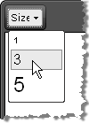

# Font Sizes


You can repopulate the Font Size dropdown with the sizes from 1 to 7 (these are the browser supported values). You can set the FontSizes collection declaratively, programmatically and using the ToolsFile.
>caption 



## Adding to FontSizes Collection Declaratively

````ASPNET
	    <telerik:RadEditor runat="server" ID="RadEditor1">
	        <FontSizes>
	            <telerik:EditorFontSize Value="1" />
	            <telerik:EditorFontSize Value="3" />
	            <telerik:EditorFontSize Value="5" />
	        </FontSizes>
	    </telerik:RadEditor>
````


## Adding to FontSizes Collection Programmatically

Use the FontSizes collection **Add()**method to include new FontSizes in the list.


````C#
	     
			RadEditor1.FontSizes.Add("1");
	        RadEditor1.FontSizes.Add("3");
	        RadEditor1.FontSizes.Add("5");
				
````
````VB
	
	        RadEditor1.FontSizes.Add("1")
	        RadEditor1.FontSizes.Add("3")
	        RadEditor1.FontSizes.Add("5")
	
````


## Using ToolsFile.xml

You can also populate the **FontSizes** dropdown using the ToolsFile, as shown in the example below:

````XML
	    <root>  
	        <tools name="MainToolbar" enabled="true">    
	            <tool name="FontSize" />  
	        </tools>  
	        <fontSizes>    
	            <item>1</item>    
	            <item>3</item>    
	            <item>5</item>  
	        </fontSizes>
	    </root>
````


If you want to apply font sizes in pixels (px) or in points (pt) then use the [Real Font Size]() dropdown.
