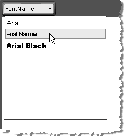

# Fonts

## Encoding for Internationalization

RadEditor is powerful enough to be used in any language you like: English, Bulgarian, Russian, Hindi, Vietnamese, Chinese, Japanese, Korean, etc.

You'll need to set the proper encoding in the aspx files with the editor. You can use the following encoding: `<?xml version="1.0" encoding="utf-8" ?>`, which will make the editor compatible with Western Europe languages, Cyrillic, Greek, Asian, Arab, Chinese, Japanese, etc characters.

>note If the characters are displayed properly by the browser on the same page where the editor is, they should be displayed properly in the editor as well.

## FontNames Collection

The WYSIWYG Fonts dropdown of RadEditor display a predefined set of fonts which by default are: Arial, Comic Sans MS, Courier New, Tahoma, Times New Roman and Verdana. All fonts are set using the FontNames Collection. You can create a new set of dropdown Font name items declaratively, programmatically or using the ToolsFile.



>note The fonts must be available on the client machine.

## Using the FontNames Collection Declaratively

````ASP.NET
<telerik:RadEditor RenderMode="Lightweight" runat="server" ID="RadEditor1">
	<FontNames>
		<telerik:EditorFont Value="Arial" />
		<telerik:EditorFont Value="Arial Narrow" />
		<telerik:EditorFont Value="Arial Black" />
	</FontNames>
</telerik:RadEditor>
````


## Using FontNames Programmatically

Use the FontNames collection **Add()** method to include new fonts in the list. When first using the **Add()** method, the Fonts dropdown will be reset, so the fonts you add will not be appended to the default set, but will rather create a new Fonts set.

````C#
RadEditor1.FontNames.Add("Arial");
RadEditor1.FontNames.Add("Arial Narrow");
RadEditor1.FontNames.Add("Arial Black");        
````
````VB
RadEditor1.FontNames.Add("Arial")
RadEditor1.FontNames.Add("Arial Narrow")
RadEditor1.FontNames.Add("Arial Black")
````

>note Bear in mind that RadEditor will persist its state (including the Fonts set) between postbacks. In order to create a new set of Fonts (e.g. for different users), you will need to clear it first. This can be done using the FontNames collection Clear() method to remove all elements or Remove() to remove specific fonts from the collection.


## Adding FontNames to ToolsFile.xml

You can also populate the **Fonts** dropdown using the ToolsFile, as shown in the example below:

````XML
<root>    
	<tools name="MainToolbar" enabled="true">    
		<tool name="FontName" />  
	</tools>    
	<fontNames>    
		<item name="Arial" />    
		<item name="Arial Narrow" />    
		<item name="Arial Black" />  
	</fontNames>
</root>
````

## See Also

 * [Default Font for Editable Content]()

 * [Font Sizes]()

 * [Colors]()

 * [Set Properties]()
