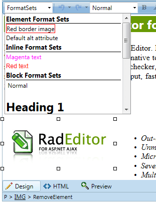

# Format Sets


The __Format Sets__ tool is used in order to apply formatting to elements or sections in the content of the editor. There are three groups of sets in the dropdown:

* __Element Format Sets__ modify the selected DOM element or the first container, which has the same tag name as the one set in tag property of the format set

* __Inline Format Sets__ behave like the __Apply Css Class__ tool and apply formatting to the parent block element or create font elemnts and apply the formatting on them

* __Block Format Sets__ apply formatting similar to the __Paragraph Styles__ tools by creating new block elemnts or replacing the currently selected ones

The set is defined by the __FormatSets__ collection which contains __EditorFormatSet__ elements. The editor format set has three properties:

* __Tag__ - it sets the tag name of the formatted DOM elements

* __Title__ - This is the HTML code, which is displayed as an option in the dropdown

* __Attributes__ - this is a __EditorFormatSetAttributeCollection__ Name (attribute name), Value (attribute value) collection, which contains the attributes wich will be set to the formatted element.

Below are some sample settings of the __FormatSets__ collection:

## Using the FormatSets Collection Declaratively

````ASPNET
	<telerik:RadEditor runat="server" ID="RadEditor1">
	    <FormatSets>
	        <telerik:EditorFormatSet Tag="H1" Title="<h1 style='color: green'>green header 1</h1>">
	            <Attributes>
	                <telerik:EditorFormatSetAttribute Name="class" Value="greenClass" />
	                <telerik:EditorFormatSetAttribute Name="style" Value="color: green;" />
	            </Attributes>
	        </telerik:EditorFormatSet>
	        <!-- Element Format Sets -->
	        <telerik:EditorFormatSet Tag="img" Title="<span style='border: 1px solid red;'>red border image</span>">
	            <Attributes>
	                <telerik:EditorFormatSetAttribute Name="class" Value="redBorderImage" />
	                <telerik:EditorFormatSetAttribute Name="style" Value="border: 1px solid red; margin: 10px;" />
	            </Attributes>
	        </telerik:EditorFormatSet>
	
	        <telerik:EditorFormatSet Tag="li" Title="<ul><li style='list-style-type: square;color: Red;'>square red list</li></ul>">
	            <Attributes>
	                <telerik:EditorFormatSetAttribute Name="style" Value="list-style-type: square;color: red;" />
	            </Attributes>
	        </telerik:EditorFormatSet>
	        <!-- Inline Format Sets (the Tag property is empty) -->
	        <telerik:EditorFormatSet Tag="" Title="<span style='color: Magenta'>magenta text</span>">
	            <Attributes>
	                <telerik:EditorFormatSetAttribute Name="style" Value="color: Magenta" />
	            </Attributes>
	        </telerik:EditorFormatSet>
	    </FormatSets>
	</telerik:RadEditor>
````


## Using FormatSets Collection Programmatically

>tabbedCode

````C#
	
	        EditorFormatSet formatSet = new EditorFormatSet("img", "Red Border Image");
	        formatSet.Attributes.Add(new EditorFormatSetAttribute("class", "RedBorderImage"));
	        formatSet.Attributes.Add(new EditorFormatSetAttribute("alr", "default alt value for Red Border Image"));
	        RadEditor1.FormatSets.Add(formatSet);
	
	        formatSet = new EditorFormatSet("h1", "Green header");
	        formatSet.Attributes.Add(new EditorFormatSetAttribute("style", "color: Green;"));
	        RadEditor1.FormatSets.Add(formatSet);
	
	        formatSet = new EditorFormatSet("", "magenta inline set");
	        formatSet.Attributes.Add(new EditorFormatSetAttribute("style", "color: Magenta;"));
	        RadEditor1.FormatSets.Add(formatSet);
	
````
````VB.NET
	        EditorFormatSet(formatSet = New EditorFormatSet("img", "Red Border Image"))
	        formatSet.Attributes.Add(New EditorFormatSetAttribute("class", "RedBorderImage"))
	        formatSet.Attributes.Add(New EditorFormatSetAttribute("alr", "default alt value for Red Border Image"))
	        RadEditor1.FormatSets.Add(formatSet)
	
	        formatSet = New EditorFormatSet("h1", "Green header")
	        formatSet.Attributes.Add(New EditorFormatSetAttribute("style", "color: Green;"))
	        RadEditor1.FormatSets.Add(formatSet)
	
	        formatSet = New EditorFormatSet("", "magenta inline set")
	        formatSet.Attributes.Add(New EditorFormatSetAttribute("style", "color: Magenta;"))
	        RadEditor1.FormatSets.Add(formatSet)
	
````
>end

## Using the ToolsFile

````XML
	<?xml version="1.0" encoding="utf-8" ?>
	<root>
	    <tools name="MainToolbar">
	        <tool name="FormatSets" />
	    </tools>
	    <formatSets>
	        <formatSet tag="img" title="Default alt attribute">
	            <attributes>
	                <item name="alt" value="Default alt attribute value"></item>
	            </attributes>
	        </formatSet>
	        <formatSet tag="a" title="<a href='#' class='greenOrangeLink' style='text-decoration: line-through;'>Green orange link</a>">
	            <attributes>
	                <item name="class" value="greenOrangeLink"></item>
	                <item name="style" value="text-decoration: line-through;"></item>
	                <item name="title" value="green, orange link"></item>
	            </attributes>
	        </formatSet>
	    </formatSets>
	</root>
````


## Display Style in Dropdown

To display the dropdown items with their corresponding formatting, add the formatted HTML in the __Title__ attribute of the corresponding __FormatSet__.

````ASPNET
	<telerik:EditorFormatSet Tag="H1" Title="<h1 style='color: green'>green header 1</h1>">
````


# See Also

 * [Set Properties]()

 * [Format Sets online demo](http://demos.telerik.com/aspnet-ajax/editor/examples/formatsets/defaultcs.aspx)
