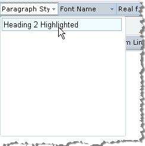

# Paragraph Styles


The Paragraph style dropdown of RadEditor displays a predefined set of styles by default. This set is defined by the **Paragraphs** collection. You can add to the **Paragraphs** collection declaratively, programmatically and using the ToolsFile.
>caption 


## Using the Paragraphs Collection Declaratively

````ASPNET
	<telerik:RadEditor ID="Radeditor1" runat="server" Skin="WebBlue">
	   <Paragraphs>
	       <telerik:EditorParagraph Title="Normal" Tag="<p>" />
	       <telerik:EditorParagraph Title="Heading 1" Tag="<H1>" />
	       <telerik:EditorParagraph Title="Heading 2" Tag="<H2>" />
	       <telerik:EditorParagraph Title="Heading 3" Tag="<H3>" />
	   </Paragraphs>
	</telerik:RadEditor> 
````


## Using Paragraphs Programmatically

Use the Paragraphs collection **Add()** method to include one or more paragraph styles in the list. When using the **Add()** method the Paragraph style dropdown will be reset, so the items you add will create a new Paragraph style set. See the example below:


````C#
	
	//Provide an option for clearing the headingRadeditor1.Paragraphs.Add("Normal", "<p>");
	
	Radeditor1.Paragraphs.Add("Heading 1", "<h1>");
	Radeditor1.Paragraphs.Add("Heading 2", "<h2>");
	Radeditor1.Paragraphs.Add("Heading 3", "<h3>"); 
	          
````
````VB
	        'Provide an option for clearing the headingRadeditor1.Paragraphs.Add("Normal", "<p>")
	
	        Radeditor1.Paragraphs.Add("Heading 1", "<h1>")
	        Radeditor1.Paragraphs.Add("Heading 2", "<h2>")
	        Radeditor1.Paragraphs.Add("Heading 3", "<h3>")
````


## Display Style in Dropdown

To display the dropdown items with their corresponding formatting, add the tag around the item name:
>caption 


## Use CSS Styles

**RadEditor** also supports block format with the CSS class set:
>caption 



````XML
	<style>
	    .myStyle {color: red;}
	</style>
````


````C#
	
	RadEditor1.Paragraphs.Add("Heading 2 Highlighted", "<h2 class=\"myStyle\">");
	          
````
````VB
	RadEditor1.Paragraphs.Add("Heading 2 Highlighted", "<h2 class='myStyle'>") 
````


## Using the ToolsFile

You can also populate the **Paragraphs** dropdown using the ToolsFile.xml, as shown in the example below (using default and custom class styles):

````XML
	<root>
	 <tools name="MainToolbar">
	   <tool name="FormatBlock" />
	 </tools>
	 <paragraphs>
	   <paragraph name="Normal" value="<p>" />
	   <paragraph name="<H1>Heading 1</H1>" value="<H1>" />
	   <paragraph name="<H2>Heading 2</H2>" value="<H2>" />
	   <paragraph name="<H3>Heading 3</H3>" value="<H3>" />
	   <paragraph name="<p class='redStyle'>redStyle</p>" value="<p class='redStyle'>" />
	 </paragraphs>
	</root> 
````


Note: The ToolsFile file is an XML file and the opening tag < bracket symbol should be encoded to [its &lt; entity](http://www.w3schools.com/html/html_entities.asp) in the **name**and **value**attributes' values.

# See Also

 * [Set Properties]()

 * [Paragraph Styles](http://demos.telerik.com/aspnet-ajax/editor/examples/formatblock/defaultcs.aspx)
