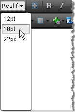

# Real Font Sizes


The Real Font Sizes dropdown displays a predefined set of font sizes in pixels and points. The dropdown is populated from the RealFontSizes Collection. You can add to the RealFontSizes collection declaratively, programmatically and using the ToolsFile.
>caption 



## Using the RealFontSizes Collection Declaratively

````ASPNET
	    <telerik:RadEditor runat="server" ID="RadEditor1">
	        <RealFontSizes>
	            <telerik:EditorRealFontSize Value="12pt" />
	            <telerik:EditorRealFontSize Value="18pt" />
	            <telerik:EditorRealFontSize Value="22px" />
	        </RealFontSizes>
	    </telerik:RadEditor>
````


## Using RealFontSizes Programmatically

Use the RealFontSizes collection __Add()__method to include new items in the list.


````C#
	
	RadEditor1.RealFontSizes.Add("12pt");
	RadEditor1.RealFontSizes.Add("18pt");
	RadEditor1.RealFontSizes.Add("22px");
	          
````
````VB
	
	        RadEditor1.RealFontSizes.Add("12pt")
	        RadEditor1.RealFontSizes.Add("18pt")
	        RadEditor1.RealFontSizes.Add("22px")
	
````


## Using the ToolsFile

You can also populate the Real Font Sizes dropdown using the ToolsFile.xml, as shown in the example below:

````XML
	    <root>
	        <tools name="MainToolbar" enabled="true">
	            <tool name="RealFontSize" />
	        </tools>
	        <realFontSizes>
	            <item value="12pt"></item>
	            <item value="18pt"></item>
	            <item value="22px"></item>
	        </realFontSizes>
	    </root> 
````


